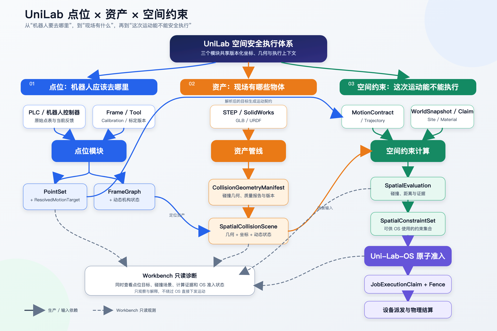
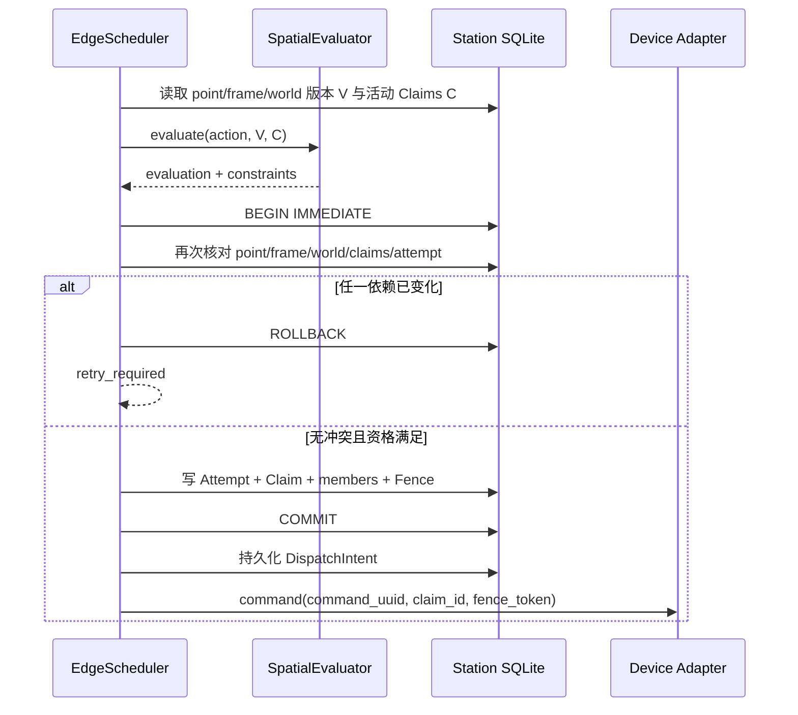

# UniLab 点位、资产与空间约束自动计算技术文档

版本：v0.4（易读重写版，技术范围与 v0.3 一致）

日期：2026-08-31

适用范围：EIT pTLC 黄金样例、投料站资产样例、UniLab Workbench、Uni-Lab-OS 空间准入集成

## 文档状态与阅读方法

这份文档说明一件事：UniLab 怎样把控制器点位、CAD 资产和机器人动作，逐步变成可检查、可追溯的空间约束证据。

整条链路分成四个职责：

```text
点位模块：机器人和设备应该去哪里
    ↓
资产模块：现场有哪些物体，它们占据什么空间
    ↓
空间约束模块：运动过程中是否发生干涉
    ↓
Uni-Lab-OS：本次作业能否完整取得资源并派发
```

每个模块都按同一顺序说明：

```text
它解决什么问题
→ 需要哪些输入
→ 怎样处理
→ 产生什么输出
→ 交给谁使用
→ 当前完成到什么程度
```

### 能力标记

| 标记 | 应怎样理解 |
|---|---|
| **[当前可用]** | 仓库中已有实现，并有本地软件测试或可复算产物。它不自动代表真机验收。 |
| **[部分实现]** | 主链路已经存在，但覆盖范围、持久化、资格或现场证据仍不完整。 |
| **[目标接口]** | 已有设计，供后续开发和集成；当前系统不一定能够实际调用。 |

本文出现“通过”时，默认只表示软件层验证通过。除非明确列出现场证据，否则不表示机器人精度验收、PLC 安全功能、硬件互锁或功能安全认证已经完成。

### 常用词先解释

| 词 | 本文中的含义 |
|---|---|
| `Frame` | 坐标系，以及它与其他坐标系之间的变换关系。 |
| `PointSet` | 一组带语义、Frame、Tool、来源和版本的点位。它比单纯的坐标表包含更多上下文。 |
| `FrameGraph` | Base、Station、Slot、Tool 等坐标系及其变换关系组成的图。 |
| `revision` | 一个对象的明确版本号。版本改变后，旧结果通常需要重新计算。 |
| `digest` | 文件或数据内容的摘要，通常使用 SHA-256。内容有任何变化，摘要也会变化。 |
| `candidate` | 候选结果，已经生成，但尚未取得正式使用资格。 |
| `shadow` | 影子运行。系统计算并记录结果，但不改变真实调度或设备行为。 |
| `qualification` | 说明一个结果经过了哪些验证，以及允许在哪个范围内使用。 |
| `unknown` | 证据不足，系统无法证明有冲突或无冲突。正式准入必须失败关闭。 |
| `TCP` | Tool Center Point，控制器用于运动和定位的工具中心点。 |
| `FK / IK` | FK 根据关节角求末端位姿；IK 根据目标位姿求关节角。 |
| `AABB / OBB` | 两种包围盒。AABB 与世界坐标轴对齐；OBB 可以随物体方向旋转。 |
| 宽相 / 窄相 | 宽相快速排除不可能相撞的对象；窄相对剩余候选做精确得多的几何检查。 |
| `StopEnvelope` | 从发出停止要求到设备真正停下期间，设备仍可能扫过的空间包络。 |
| `Claim` | OS 对设备、物料、工位和空间互斥资源的占用声明。 |
| `Fence` | 防止过期命令或旧执行者继续操作资源的隔离令牌。 |
| `CAS` | 提交前再次比较版本；版本已变化时放弃本次结果并重新计算。 |
| `P2 / W2` | 本项目的阶段名。P2 是精确子树和分解范围的审核产物；W2 是获得批准后的 SolidWorks 几何导出与交接阶段。 |

v0.4 只调整表达和结构，没有把计划、候选计算或影子结果提升为生产能力。v0.3 中的 multi-sphere/compound-convex 比较、pTLC 40-component 罐架窄相、Workbench 组件投影和测试结果均保留。

## 0. 先用一个例子理解整套系统

假设业务请求是“让 CR5 抓取 1 号罐”。系统需要依次回答：

1. “1 号罐抓取点”对应哪个 PointSet 点位？使用哪个 Tool 和坐标系？
2. CR5、夹爪、罐、罐架和桌面的碰撞几何分别是什么？它们现在位于哪里？
3. 从当前关节状态运动到抓取点时，机器人会不会碰到自身、罐架、桌面或其他正在执行的动作？
4. 即使几何检查没有发现冲突，相关设备、物料、工位和空间资源是否能被一次性取得？

因此，四部分的关系是：

```text
点位告诉系统“目标在哪里”
资产告诉系统“哪些东西占据空间”
空间约束告诉系统“计算覆盖内发生了什么”
OS 根据版本、资格和资源竞争决定“本次能否派发”
```



图中实线表示生产或输入依赖，虚线表示 Workbench 的只读观测关系。

## 0.1 四个模块分别负责什么

| 模块 | 它回答的问题 | 主要输出 | 职责边界 |
|---|---|---|---|
| 点位 | 目标的语义、Frame、Tool、关节和局部几何是什么？ | PointSet、FrameGraph、ResolvedMotionTarget | 不单独证明整条路径无碰撞。 |
| 资产 | 每个实体的几何、尺寸、坐标和质量报告是什么？ | CollisionGeometryManifest、资产实例 | 不授予机器人执行权。 |
| 空间约束 | 轨迹、自碰撞、环境碰撞和动作冲突情况怎样？ | SpatialEvaluation、SpatialConstraintSet | 不直接创建资源锁。 |
| Uni-Lab-OS | 哪个作业能取得完整资源集合并安全派发？ | Claim、Fence、DispatchIntent | 不重新处理 CAD 几何。 |
| Workbench | 人怎样查看点位、资产、轨迹、碰撞和准入状态？ | 只读 3D 和状态投影 | 不修改许可和物理事实。 |

## 0.2 阅读全文时要记住的四条边界

1. PLC 的 `Point=17` 是状态编号。只有结合 PointSet 的明确版本，系统才能查到它代表的语义目标。
2. 视觉 GLB 主要给人查看。碰撞计算需要带摘要、坐标、质量报告和资格信息的碰撞资产。
3. `no_conflict_observed` 只说明在已声明的计算覆盖内没有观察到冲突，不能直接转换成 `allowed=true`。
4. 软件 Claim/Fence 不能替代急停、安全 PLC、围栏和停止距离验证。

---

# 第一部分：点位——机器人和设备应该去哪里

## 1. 点位模块解决什么问题

点位模块管理目标及其来源关系。它需要回答：

- 这个点代表哪个工站、槽位、物体和操作？
- 坐标是相对于 Robot Base、Station、Slot、Tool 还是其他 Frame？
- 六个数字表示法兰位姿、TCP 位姿还是功能坐标？
- 点位来自哪个控制器版本和哪次采集？
- 工站或工具移动后，哪些点需要重新计算和验证？

一个可以进入空间计算的点位，至少需要以下信息：

```text
稳定语义 ID
+ Station / Slot / Object / Workcell 归属
+ reference frame
+ pose 或 joint target
+ Tool / User Frame
+ 机器人和导轨的精确型号
+ Installation / Tool / Station calibration
+ approach / interaction / retreat
+ 来源快照与摘要
+ 资格状态和适用范围
```

这里的关键是保存几何关系。例如，抓取点可以保存在 Slot 局部坐标系下。工站整体移动后，只需更新 Station Registration，再重新解析所有相关点位。这样可以准确识别失效范围，也便于做最小恢复。

点位模块参考外部分析《实验室机器人点位、坐标系标定与恢复管理分析》中的恢复原则；该外部文档未随本仓发布，复现不能依赖其本机绝对路径。

## 2. 点位模块需要哪些输入

### 2.1 PLC 和控制器可能提供的五类信息

控制器返回的数据长得相似，但含义可能完全不同。采集后必须先分类。

| 类型 | 典型字段 | 应怎样解释 |
|---|---|---|
| 程序选择 | `FunctionID`、program selector | 表示要执行哪个程序。它本身没有空间坐标。 |
| 状态点编号 | `Point=17`、Home、Ready | 表示控制器当前状态。需要结合 PointSet revision 才能解析语义。 |
| 机器人笛卡尔目标 | pose、user、tool | 需要确认单位、欧拉角顺序、法兰/TCP 和用户坐标定义。 |
| 关节目标或反馈 | J1…J6、地轨轴 | 目标可以成为 PointSet 候选；瞬时反馈属于 Observation。 |
| PLC 伺服点 | target、ActPos、HMI mirror、limits | 用于活动机构目标、当前状态和示教采点。 |

程序 selector、状态码和 observed joint state 都不能自动当成目标点。只有笛卡尔位姿时，也不能为了方便而凭空固定一个 IK 解。

### 2.2 原始点位快照

#### 这是什么

`ControllerPointSnapshot/v1` 保存一次只读采集得到的原始控制器证据。建议统一为以下目标接口：

**[目标接口，已有 v0 草案]**

```json
{
  "schema": "unilab.controller-point-snapshot/v1",
  "snapshot_id": "point_snapshot_...",
  "controller_id": "cr5-main-controller",
  "controller_revision": "v0.11",
  "controller_boot_id": "boot_...",
  "captured_at": "2026-08-31T10:20:30Z",
  "monotonic_sequence": 418,
  "native_units": {
    "translation": "mm",
    "rotation": "deg",
    "joint": "deg"
  },
  "pose_representation": "vendor_euler_declared_order",
  "records": [],
  "raw_payload_sha256": "sha256:..."
}
```

重要字段的作用如下：

| 字段 | 用途 |
|---|---|
| `controller_id` | 说明数据来自哪台控制器。 |
| `controller_revision` | 保存控制器接口声明的 revision；该 revision 覆盖软件、配置还是点表，需要由适配器明确说明。 |
| `controller_boot_id` | 标识控制器当前这次启动。重启后必须变化。 |
| `captured_at` | 记录采集时间。 |
| `monotonic_sequence` | 记录快照顺序，帮助发现倒序、重复或遗漏。 |
| `native_units` | 保存供应商原始单位，防止后续误解。 |
| `pose_representation` | 保存原始姿态表达方式和欧拉角约定。 |
| `raw_payload_sha256` | 绑定原始字节，证明证据没有被悄悄替换。 |

#### 为什么采集前后要各读一次控制器身份

读取完整点表可能需要一段时间。采集过程中，控制器可能重启、升级或切换配置。为了防止一份快照混入两个时期的数据，采集器应按以下顺序工作：

```text
1. 读取 revision=A、boot_id=X
2. 只读获取完整数据块
3. 再读取 revision=B、boot_id=Y
4. 只有 A=B 且 X=Y，才接受这份快照
```

例如，开始时 `boot_id=boot_123`，结束时变成 `boot_124`。这说明控制器在采集期间重启过。即使 revision 都是 `v0.11`，快照也必须丢弃并重新采集。

这项检查只能发现版本切换和重启。如果控制器允许点表在运行中被修改，还应增加会随点表修改而变化的 `point_database_revision`，并在采集前后一起检查。

#### “只读”具体限制什么

采集程序只能查询数据。它不得：

- 写入、覆盖或保存点位；
- 进入示教或标定流程；
- 触发机器人或 PLC 机构运动；
- 修改控制器配置和运行状态。

### 2.3 坐标和标定输入

原始点位需要与以下信息组合，才能解释成真实空间目标：

| 输入 | 它解决的问题 |
|---|---|
| Robot model | 机器人具体型号、关节顺序、零位、方向、限位和 FK revision 是什么？ |
| ToolContext | 当前装了什么工具？固定工具主体和功能坐标分别在哪里？对应哪个控制器工具号？ |
| InstallationCalibration | 设备局部 Frame 怎样转换到 Robot Base？ |
| StationRegistration | 当前安装状态下，Robot Base 到 Station 的权威变换是什么？ |
| PLC axis model | 轴零点、方向、单位、行程，以及轴值怎样转换成机构位姿？ |
| OperationTemplate | interaction、approach、retreat、速度、接触和成功条件是什么？ |
| Observation | 当前关节、PLC ActPos、机构到位、图像和时间戳是什么？ |

如果六个数没有 Frame 或 Tool 语义，系统只能把它保留为 `unresolved`，不能默认解释为 Robot Base 下的法兰目标。

## 3. 点位数据怎样处理

### 3.1 第一步：只读采集和记录分类

#### 先按实际含义分类

```text
cartesian_target       → PointSet 候选
joint_target           → PointSet 候选
cartesian+joint pair   → FK 一致性检查
observed_joint_state   → Observation
servo_axis_target      → PLC 轴点候选
servo_axis_actual      → 当前世界状态或示教观测
program_selector       → PLCProgramSet
point_status_code      → 状态见证
```

“候选”表示数据已经被采集，但尚未完成单位、Frame、Tool、FK、限位和资格检查。采集到一个点，并不代表这个点已经可以用于正式运动。

#### 原始证据与规范化结果分开保存

每条原始记录都要保留控制器身份、revision、原始单位、采集时间和来源摘要。后续转换产生一份新的派生记录，不能覆盖原始值。

例如，控制器返回：

```json
{
  "point_name": "P12",
  "x": 523.417,
  "y": -81.203,
  "z": 246.900,
  "rx": 179.8,
  "ry": 0.2,
  "rz": 89.7,
  "unit": "mm/deg",
  "euler_order": "vendor_order"
}
```

系统可以派生出米制和平移加四元数的统一表示：

```json
{
  "translation_m": [0.523417, -0.081203, 0.246900],
  "quaternion_xyzw": ["..."]
}
```

两份数据应一起保存，并记录派生关系：

```json
{
  "raw_record_ref": "snapshot_418/record/P12",
  "normalized_record": {
    "translation_m": [0.523417, -0.081203, 0.246900],
    "quaternion_xyzw": ["..."]
  },
  "normalization": {
    "method": "vendor_euler_to_quaternion/v1",
    "source_digest": "sha256:..."
  }
}
```

这样，出现偏差时才能判断问题来自控制器原始数据、单位换算、欧拉角顺序、坐标变换还是浮点舍入。

### 3.2 第二步：统一单位、姿态和 Frame

规范化按以下规则进行：

1. 存储层统一使用 m 和 rad；界面可以显示 mm 和 deg。
2. 明确供应商欧拉角顺序、四元数顺序和旋转方向。
3. 明确 pose 表示法兰、TCP，还是用户坐标下的功能坐标。
4. 把 user/tool 编号解析成带 revision 和 digest 的 Frame 与 ToolContext。
5. PLC 轴值经过零点、比例、方向和机构学模型后，才能转换成世界坐标。

每一步转换都应记录输入摘要、算法版本和输出，确保结果可以重算。

### 3.3 第三步：建立 PointSet

**[当前基础]** `dependencies/unilab_robot_template` 已有 `unilab.robot-point-set/v3`。

PointSet 保存的是带语义和依赖关系的点位集合。不同类型的点应使用不同表达：

| 点位类型 | 推荐保存方式 | 相关对象变化后怎样处理 |
|---|---|---|
| Home、维护姿态、安全锚点 | 关节配置 | Station 移动时通常不变。 |
| Workcell 通道点 | Workcell/Base 目标或规划约束 | 场景变化后重新规划。 |
| Station Ready/Observation | Station 局部目标 | 更新 Registration 后重新解析。 |
| Slot 抓取/放置点 | `Slot→G` 局部模板 | 保留模板，重算 Base 下法兰目标。 |
| approach/retreat | offset、axis、corridor | 与 interaction 一起重算和检查。 |
| 活动机构接口 | `A(state)→P` | 根据 PLC actual 和到位状态解析。 |
| 阵列孔位 | anchors + grid + per-slot correction | 整架移动改 Registration；单格问题改内部几何。 |
| PLC 多轴工艺点 | composite members | 整体校验限位后完整下发。 |

每个 PointSet revision 都要绑定精确 robot model、ToolContext、InstallationCalibration 和 source digest。发布后保持不可变；需要修改时发布新 revision。

### 3.4 第四步：把局部点解析成机器人目标

本文统一使用 `${}^{A}T_B` 表示“把 B 坐标中的量转换到 A 坐标”。

含 PLC 活动机构时，某个目标点 P 在 Robot Base B 下的位置为：

$$
{}^{B}T_P(q_{plc})
= {}^{B}T_S\,{}^{S}T_A(q_{plc})\,{}^{A}T_P
$$

可以按三步理解：

```text
P 在活动机构 A 中的位置
→ 根据 PLC 轴值 q_plc 求 A 在 Station S 中的位置
→ 使用 Station Registration 求 P 在 Robot Base B 中的位置
```

如果局部模板保存的是 Slot 下的功能目标 `${}^{P}T_G^{*}`，运行时需要转换成法兰目标：

$$
{}^{B}T_E^{*}
= {}^{B}T_P(q_{plc})\,{}^{P}T_G^{*}\,({}^{E}T_G^{current})^{-1}
$$

其中：

- `E` 是机器人法兰；
- `G` 是当前工具的功能坐标；
- 最后一项用于从功能目标反推法兰应该到哪里。

如果控制器给出用户坐标 U 下的功能坐标 G：

$$
{}^{B}T_G={}^{B}T_U\,{}^{U}T_G,
\qquad
{}^{B}T_E={}^{B}T_G\,({}^{E}T_G)^{-1}
$$

固定工具主体和随开度、接触变化的功能抓取坐标需要分开建模。移动指尖中点或软接触点不应永久注册成固定 TCP。

### 3.5 第五步：检查一致性和使用资格

如果同一个点同时提供 pose 和 joint，系统应使用关节角计算 FK：

$$
{}^{B}T_E^{FK}=FK(q)
$$

然后把控制器 pose 转换到相同的 Base 和法兰定义，再比较两者差值。

例如：

```text
控制器保存的笛卡尔目标：Base 下法兰位姿 A
关节目标通过 FK 得到：Base 下法兰位姿 B

如果 A 与 B 的差值超过该操作的阈值：
→ 输出 `frame_or_fk_inconsistent`
→ PointSet candidate 失败
→ 不自动选择其中一边继续
```

离线门禁至少检查：

- 关节和 PLC 轴数量、单位、限位及数值有限性；
- 稳定 ID、引用关系和 digest；
- FK 与笛卡尔 pose 一致性；
- Tool/User Frame 与控制器配置一致性；
- 点位归属和变换链完整性；
- approach、interaction、retreat 的路径和碰撞候选；
- PointSet 新旧版本的 semantic diff。

## 4. 点位模块输出什么

| 输出 | 内容和用途 |
|---|---|
| `ControllerPointSnapshot` | 原始 PLC/控制器点表和观测证据。 |
| `PointSet` | 语义点位、局部模板、关节/导轨目标和接近块。 |
| `FrameGraphSnapshot` | 本次使用的 Base、Station、Tool 和机构变换快照。 |
| `ResolvedMotionTarget` | Base 下的目标、关节候选、地轨位置和完整来源链。 |
| `PointConsistencyReport` | FK、Frame、限位、漂移和 unknown 原因。 |
| `PointSetQualification` | 点表摘要、低速试运行、参考验证和批准范围。 |
| `PointRecoverySession` | 变化、影响范围、修复、验证和激活记录。 |

正式交给资产和空间模块的内容是：

```text
PointSet digest
+ FrameGraph digest
+ ResolvedMotionTarget
+ ToolContext
+ PLC dynamic state
+ point/frame uncertainty
```

资产模块使用 FrameGraph 和 PLC 动态状态放置资产实例；空间模块使用 ResolvedMotionTarget 生成轨迹。

## 5. 点位怎样调试

调试按八步进行。前四步只处理数据，不运动机器人：

1. **只读采集**：冻结控制器/PLC identity、revision、boot ID、原始点表和摘要。
2. **语义分类**：分开 selector、status、target 和 observation，并补充 Station、Slot、Operation 归属。
3. **坐标规范化**：转换单位、姿态、法兰/TCP、User/Tool 和 PLC 轴模型。
4. **离线验证**：检查 FK、限位、引用、场景显示、路径和碰撞候选。
5. **建立维护会话**：独占机器人、导轨和相关空间区域，从已验证安全锚点开始。
6. **低速复核**：执行 capture → 退出 → 二次进入 → 读取反馈 → drift 检查。
7. **物理资格验证**：用独立 Reference Set 检查 Station 和 Tool 的实际功能位置。
8. **不可变发布**：发布新 revision，并原子切换兼容的 PointSet、Frame 和 Tool 组合。

**[当前基础]** `PointMaintenanceService` 已把维护试运行的速度和加速度比例限制在 10% 以内，并要求目标试运行见证、人工批准和不可变发布。这个限制只是软件维护门禁；现场仍需验证 10% 对具体设备、工具和工况是否安全。

Workbench 的点位调试页应同时显示：

- 原始 pose/joint 和规范化法兰 pose；
- PointSet target_ref、所属 Frame 和完整变换链；
- Tool 和功能坐标 G；
- PLC target、ActPos、HMI mirror 和差值；
- 旧/新 PointSet、Registration、Tool Calibration 的差值；
- FK 残差、approach/retreat、工具和 payload 包络、候选碰撞；
- 当前资格、unknown 原因，以及是否允许维护试运行。

## 6. 点位和坐标系怎样恢复

### 6.1 先找出哪一种关系变了

| 发现的问题 | 应更新的对象 |
|---|---|
| 工站整体偏移 | Station Registration。 |
| 工具整体安装偏移 | Tool Calibration。 |
| 相机安装变化 | Hand-eye，并重新验证相关 Registration。 |
| PLC 轴重新找零 | 轴 calibration 或 `S→A(q)`。 |
| 单个内部模块变化 | Slot 或 Module Geometry。 |
| 工艺模板错误 | 新 OperationTemplate revision。 |
| 当前耗材随机偏差 | 记录为本次 Observation，不长期写回基线。 |
| 机器人零位异常 | 进入 `BLOCKED` 和机器人诊断。 |

大量点位同时出现类似偏移时，应优先检查 TCP、Station Registration 和机器人零位。给几十个点分别添加 Offset 会掩盖共同原因，也会扩大恢复范围。

### 6.2 最小恢复状态机

```text
发现变化或碰撞
→ BLOCKED
→ 冻结旧点表、PLC/机器人状态和执行证据
→ 检查机械、设备、持物和工艺状态
→ 找出失效关系
→ 生成候选 Calibration / Registration / PointSet
→ 重算目标、资产场景、路径和空间约束
→ 独立参考验证和代表性低风险动作
→ 核对 Material / Site / 不可逆步骤
→ 原子激活兼容版本
→ ACTIVE，或继续 BLOCKED
```

恢复旧配置文件只恢复软件记录。物理装配已经改变时，旧物理关系不会自动恢复。旧版本可以用于审计，重新激活前仍需证明它与当前现场相符。

### 6.3 常见变化会影响哪些对象

| 变化 | 主要更新 | 自动失效范围 |
|---|---|---|
| 工站刚体移动 | `B→S` | 该站局部点、资产实例、轨迹和 evaluation。 |
| PLC 轴重新找零 | `S→A(q)` | 动态机构、Site、目标和 StopEnvelope。 |
| Tool 刚性偏移 | `E→T/G` | 工具相关法兰目标、IK、路径和碰撞包络。 |
| 相机支架变化 | `E→C` | 由相机观测产生的 Registration。 |
| Robot Base 或零位变化 | `W→B` 或运动学 | 全部点位、FK 和空间证书。 |
| 单个 Slot 变化 | `S→P` 或 `A→P` | 对应 Slot 和操作。 |
| PLC actual 未知 | 不修改基线 | 当前 WorldSnapshot 和相关动作许可。 |

碰撞后，系统不应自动松爪、回 Home、释放 Claim 或重发动作。需要先确认接触、持物、物料和不可逆工艺状态，形成 `PhysicalSettlement` 后再释放旧 Claim/Fence。

## 7. 点位模块当前做到哪一步

| 能力 | 当前状态 | 使用边界 |
|---|---|---|
| pTLC 控制器点表 | 有 74 条原始记录，包含 pose、joint、tool 和 user | 是迁移来源，尚未形成统一资格合同。 |
| pTLC `PointRegistry` | 有稳定 ID、role、workstation、rail、safe anchor、派生点和网格 | 仍是项目专用结构，未完整迁移到 PointSet v3。 |
| pTLC 点位维护 | 有 DEBUG capture、plan、teach move、drift 和 confirm commit | 缺少通用 Frame、空间和 OS Claim 证据链。 |
| pTLC PLC 伺服点 | 有 ActPos、限位、PC 真值、push、diff/pull 和 composite | 它描述 PLC 轴，不是机器人 6DoF 点表。 |
| Robot PointSet v3 | 有 exact model、ToolContext、InstallationCalibration、grid、access 和 digest | 尚未接入 EIT 空间激活链。 |
| PointMaintenanceService | 有低速试运行、人工资格和不可变发布 | 尚未证明 pTLC 全部真实点表已经按该流程资格化。 |
| Controller point adapter v0 | 有 snapshot、classify 和 normalize 草案 | 生产采集器和完整 Schema 未完成。 |
| Point-aware OS admission | 未完成 | 还没有 point/frame version CAS 和原子 Claim 集成。 |

本轮复核中，PointSet v3/PointMaintenance 定向测试 15 项通过；pTLC 点位、单一真源及 PLC 读写确认相关测试 32 项通过。它们都是离线软件证据。本轮没有连接 PLC 或机器人，也没有执行现场标定。

---

# 第二部分：资产——现场有哪些物体，它们占据什么空间

## 8. 资产模块解决什么问题

资产模块把 STEP、SolidWorks、GLB 和 URDF 转换成两套用途不同的几何：

```text
视觉资产：保留材质和细节，供 Workbench 展示
碰撞资产：控制复杂度和误差，供空间计算使用
```

空间计算需要知道几何来自哪里、使用什么单位、绑定哪个 Frame、误差多大、经过哪些检查。因此正式输入是带清单和摘要的资产包，而不是单独一个 GLB 文件。

## 9. 资产模块需要哪些输入

| 输入 | 示例 | 它解决的问题 |
|---|---|---|
| `asset_id` | `develop_tank_rack_01` | 跨版本怎样识别同一个资产？ |
| `source_uri` | `feeding_station.SLDASM` | 原始几何来自哪里？ |
| `source_digest` | `sha256:...` | 本次结果具体绑定哪一份源文件？ |
| `source_format` | solidworks/step/glb/urdf | 应使用哪种解析和验证规则？ |
| `approved_occurrence_roots` | `Station/TankRack` | SolidWorks 装配允许处理哪棵精确子树？ |
| `unit` | mm | 源几何使用什么单位？ |
| `source_frame` | `sw_assembly_origin` | 原始坐标系在哪里？ |
| `target_frame` | `station:tank_rack` | 资产最终绑定到哪个语义 Frame？ |
| `asset_role` | static/tool/payload/robot_link | 资产怎样参与碰撞和动态更新？ |
| `generation_levels` | L0/L1/L2 | 需要生成哪些碰撞候选？ |
| `tolerances` | missed envelope、cavity 等 | 自动质量门槛是什么？ |

点位模块还会提供两项运行时信息：

1. **FrameGraph**：资产局部坐标怎样转换到 Station、Robot Base 和 World。
2. **PLC dynamic state**：地轨、抽屉、升降轴和门当前处于什么位置。

## 10. 资产怎样处理

### 10.1 第一步：限定准确的导出范围

大型 SolidWorks 装配中，名称相似的组件可能很多。自动导出不能靠模糊名称扩大范围。每次只能处理已经批准的 exact occurrence roots，并绑定装配 revision 和源摘要。

**[部分实现]** `scripts/sw_exact_subtree_exporter.py` 目前只执行 dry-run：

```text
读取请求
→ 验证批准的精确子树
→ 生成导出计划和失败原因
→ 不执行正式 W2 导出
```

feeding-station 当前 P2 是 `human_reviewed=false / publication_eligible=false` 的草案。覆盖率完整只说明条目都被列出，仍需人工确认范围后才能进入 W2 正式导出。

### 10.2 第二步：生成视觉资产

视觉资产保留材质、纹理和较高细节，主要供 Workbench 使用。它仍要记录单位、轴向、原点和 source digest，方便追溯和正确放置。

视觉资产只有显示用途时，不能直接进入碰撞计算。碰撞计算还需要专用几何、质量报告和资格信息。

### 10.3 第三步：生成 L0、L1、L2 碰撞候选

**[当前可用，候选资格]** `scripts/generate_collision_candidates.py` 支持三个层级：

| 层级 | 几何形式 | 优点 | 主要风险 | 适用位置 |
|---|---|---|---|---|
| L0 | AABB / OBB | 快、确定 | 会填满空腔，假碰撞较多 | 宽相首轮筛选。 |
| L1 | primitive / convex hull / multi-sphere | 更接近轮廓，成本仍较低 | 凹槽可能消失，球集可能严重过填充 | 动态部件宽相或中相。 |
| L2 | compound convex / simplified mesh | 能保留更多凹形和空腔 | 组件多，计算成本较高 | 静态环境精检候选。 |

当前 STEP 流程先绑定原始 STEP 摘要和显式三角化的 GLB，再从 GLB 生成候选。它没有直接进行 CAD 内核级 B-rep 精确求值，因此资格说明必须保留这项限制。

生成器 v3 会为 L2 同时输出米制 binary STL，并记录 `component_triangle_counts`。STL 文件不保存组件名称；这份分段信息用于恢复每个凸组件的三角形范围。缺少它时，两个相互接触但语义独立的凸体可能被错误合并成一个非凸体。

### 10.4 第四步：检查候选质量

候选生成完成后，需要回答以下问题：

| 指标 | 检查内容 | 失败后怎样处理 |
|---|---|---|
| 尺寸误差 | 候选与源模型的长宽高相差多少？ | 超过阈值时不提升资格。 |
| 漏包络误差 | 是否有真实表面落在碰撞体外？ | 失败关闭，或使用有依据的显式膨胀。 |
| 空腔保留 | 孔位、门洞和抓取通道是否仍存在？ | 改用 L2 或人工建模。 |
| component 数 | 分解是否过多或过少？ | 调整参数后重新生成。 |
| watertight | 网格是否闭合？ | 限制算法用途或修复网格。 |
| 面数和简化率 | 运行成本是否在预算内？ | 重新简化并复核误差。 |
| 生成器版本 | 其他人能否复算相同结果？ | 固定版本、参数和 canonical JSON。 |

自动 QC 通过后，关键资产仍需进行坐标审阅、外形审阅和场景回放。生成成功只说明工具产出了文件，不说明资产已经获批。

#### pTLC 罐架的实际选择例子

同一个罐架生成了两种候选：

| 候选 | component | 漏包络 | 新增填充比例 | 空腔 | 结果 |
|---|---:|---:|---:|---|---|
| multi-sphere | 40 个解析球 | 约 `2.78e-17 m` | 约 `9.56` | `not-preserved` | 拒绝。虽然包住源几何，但过于保守。 |
| compound convex | 40 个凸组件 | `0 m` | 约 `4.35e-17` | `preserved` | 选为当前离线窄相候选。 |

这个例子说明，“没有漏包络”只是必要条件。系统还要检查额外填充、尺寸误差和空腔。否则，一个覆盖很大的粗糙包络会制造大量假碰撞。

### 10.5 第五步：编译碰撞资产清单

资产模块与空间模块之间的正式交接入口是：

```text
lab.collision-geometry-manifest/v1
```

`CollisionGeometryManifest` 至少绑定：

- asset ID、版本、角色和用途；
- source、visual、collision 文件摘要；
- 单位、source frame、target frame 和固定变换；
- L0/L1/L2 几何及其 components；
- 源尺寸、候选尺寸和 QC 结果；
- generator、版本、参数和环境；
- qualification、审阅记录和拒绝原因。

当前 pTLC 的选择策略位于：

```text
config/ptlc-collision-candidate-selection.v1.json
```

Manifest 编译器会校验 candidate report、generator 和 runtime geometry 的摘要，并检查：

```text
AABB 相对误差
+ 漏包络
+ watertight
+ 空腔
+ component 数
+ STL triangle 分段
```

任一内容漂移或超过阈值，编译都会失败关闭。没有被选中的资产按照明确的 fallback policy 使用原参数化代理，系统不会静默切换模型。

推荐资产包结构：

```text
collision-assets/<asset_id>/<version>/
  visual.glb
  collision_l0.glb
  collision_l1.glb
  collision_l2.glb
  collision_l2.runtime.stl
  collision-candidate-report.json
  collision-geometry-manifest.json
```

## 11. 点位和资产怎样配合

资产清单描述“对象自身的几何”；FrameGraph 描述“这个对象实例当前放在哪里”。两者组合后才能生成世界空间中的碰撞实例：

```text
CollisionGeometryManifest
+ asset instance ID
+ FrameGraphSnapshot
+ PLC axis state
+ uncertainty
→ world-space collision instance
```

实例化按以下顺序进行：

1. 校验 manifest digest、单位和资格。
2. 读取 asset-local 碰撞几何。
3. 通过 FrameGraph 解析 asset-local → Station/机构 → World。
4. 对动态设备应用 PLC actual 或已确认机构状态。
5. 根据 point、frame 和 asset uncertainty 扩大包络。
6. 把结果加入 `SpatialCollisionScene`。

例如，同一种罐架可以在现场安装两套。两个实例可以共享一个资产 manifest，但必须拥有不同 instance ID 和 Station Registration。复制 GLB 后手工移动顶点会改变资产内容，必须产生新的摘要和版本。

### 11.1 发现问题时应该改哪一层

| 问题 | 应修改的对象 |
|---|---|
| mesh 外形错误 | 新 CollisionGeometryManifest。 |
| 资产原点定义错误 | 修复资产 Frame 并重新发布。 |
| 工站整体移动 | 新 StationRegistration。 |
| 抽屉或升降轴位置变化 | 新 PLC dynamic state 或 WorldSnapshot。 |
| 工具刚性偏移 | 新 ToolCalibration。 |
| 单个 Slot 变化 | 新内部几何或 Slot Frame。 |

点位 Offset 无法修复错误的资产原点；移动 mesh 也无法修复错误的 Tool 或 Station Calibration。每类变化应落在拥有该事实的对象中。

## 12. 资产模块输出什么

| 输出 | 下游怎样使用 |
|---|---|
| visual assets | Workbench 3D 展示。 |
| collision L0/L1/L2 | 空间宽相、窄相和连续碰撞。 |
| candidate QC report | 自动发布门禁和人工审阅。 |
| CollisionGeometryManifest | 编译 SpatialCollisionScene。 |
| asset/frame binding | 使用 Point/Frame 放置场景实例。 |
| qualification/digest | WorkCellActivation、CI 和 OS 资格检查。 |

`WorkCellActivation` 用来冻结一组互相兼容的版本：

```json
{
  "workcell_id": "ptlc_station_01",
  "point_set_digest": "sha256:...",
  "frame_graph_digest": "sha256:...",
  "asset_manifest_digests": {
    "cr5": "sha256:...",
    "tank_rack": "sha256:...",
    "table": "sha256:..."
  },
  "tool_context_digest": "sha256:...",
  "action_contract_set_digest": "sha256:...",
  "qualification": "candidate_shadow"
}
```

其中任一 digest 发生变化，都应产生新的激活版本，并使依赖旧版本的空间评估失效。

## 13. 资产模块当前做到哪一步

| 能力 | 当前状态 | 使用边界 |
|---|---|---|
| pTLC CollisionGeometryManifest | 已实现并测试 | 资格仍是 `collision-candidate`。 |
| 通用 STEP/GLB L0/L1/L2 和 QC | 已实现并有软件测试 | STEP 依赖显式 GLB tessellation。 |
| multi-sphere 候选与自动选择门 | 已实现并测试 | pTLC 罐架球集因过填充被拒绝。 |
| pTLC 罐架 compound-convex 运行时绑定 | 已实现，共 40 components | 来源为当前 GLB，仍是离线候选。 |
| SolidWorks exact subtree | 只有只读 dry-run | feeding-station P2 未批准，W2 未执行。 |
| pTLC 15 个环境实体 | 已进入离线场景 | 当前资格为 candidate/shadow。 |
| WorkCellActivation | 目标接口 | 尚未成为生产激活的权威来源。 |
| PLC 动态机构到通用资产 pose | 项目专用逻辑中已有部分实现 | 尚未形成统一 FrameGraph/WorldSnapshot。 |

当前可复算命令：

```bash
./.venv/bin/python scripts/compile_collision_geometry_manifest.py --check
```

```bash
uv run --project related/unilabSZlab/asset_pipeline \
  --with scipy --with fast-simplification \
  python scripts/generate_collision_candidates.py \
  --request config/collision-candidate-develop-tank-rack.v1.json \
  --output-dir artifacts/collision-candidates/v3/develop-tank-rack
```

---

# 第三部分：空间约束——运动是否会发生干涉

## 14. 空间约束模块解决什么问题

空间约束模块回答三类问题：

1. 一个动作自身是否造成机器人自碰撞或环境碰撞？
2. 动作 A 和动作 B 是否可以在时间上重叠？
3. 当轨迹、几何或误差覆盖不足时，具体缺少什么证据？

它产生几何和动作约束证据。最终执行权仍由 Uni-Lab-OS 根据当前版本、资格和资源竞争统一决定。

## 15. 空间约束模块需要哪些输入

| 输入 | 来源 | 提供什么信息 |
|---|---|---|
| PointSet / ResolvedMotionTarget | 点位模块 | 起点、终点、关节/笛卡尔目标、地轨和来源链。 |
| FrameGraphSnapshot | 点位模块 | Base、Station、Tool、活动机构和 Slot 变换。 |
| CollisionGeometryManifest | 资产模块 | robot、tool、payload、environment 几何和资格。 |
| SpatialCollisionScene | 资产和 Frame | 本次参与计算的世界空间实例。 |
| MotionContract | 动作编译器 | MoveJ、MoveL、CP、速度、TCP 和 attach/detach。 |
| SpatialWorldSnapshot | Uni-Lab-OS | Site、Material、活动 Claim/Fence、工具和机构状态。 |
| UncertaintyPolicy | 资格配置 | CAD、标定、跟踪、payload 和 StopEnvelope。 |

所有输入都必须绑定摘要或版本。PointSet、Frame、Tool、asset、action、world 或 policy 任一项变化，旧 evaluation 都不能直接用于新准入。

## 16. 空间约束怎样计算

### 16.1 第一步：把业务动作解析成 MotionContract

业务层可以提交：

```text
robot.tank.pick(tank_id=1)
```

动作编译器把它展开成统一 MotionContract，明确：

- 使用哪台机器人和哪个地轨位置；
- 使用哪个 PointSet target_ref；
- 当前 TCP、ToolContext 和 payload；
- 起点、终点和各轨迹段；
- MoveJ、MoveL、CP/blend 的控制器语义；
- tool/payload attach 和 detach 事件；
- 速度、加速度和停止策略。

业务名称只有在绑定这些事实后，才成为可以计算的运动请求。

### 16.2 第二步：展开一条共享时间轴

空间计算和 Workbench 播放都从同一条时间轴生成：

```text
t
→ joint_state(t)
→ FK
→ link_pose(t)
→ tool_pose(t)
→ payload_pose(t)
```

不同运动类型的展开方式不同：

- **MoveJ**：在关节空间插值。
- **MoveL**：在笛卡尔空间插值 TCP，再用 IK 求每帧关节状态。
- **CP/blend**：按照控制器的圆滑过渡语义生成连续轨迹。
- **attach/detach**：从明确事件帧开始改变 tool 或 payload 的附着关系。

Workbench 动画与碰撞计算必须使用同一份逐帧关节状态。否则画面显示的运动和后台检查的运动可能不一致。

### 16.3 第三步：计算每一帧的机器人和资产位置

每帧通过 FK 计算 CR5 `base_link + Link1..Link6` 的位姿，并同步更新 tool、payload 和 PLC 活动机构。

```text
点位模块提供目标和 Frame
+ 资产模块提供每个 link 和实体的碰撞几何
+ 当前时间轴提供 joint state 和机构状态
→ 当前帧的完整碰撞场景
```

### 16.4 第四步：用宽相快速筛选

宽相使用 AABB、OBB、swept AABB 或 motion corridor 排除明显不可能相撞的对象。它主要筛选：

- 非相邻 robot link 对；
- link、tool、payload 与环境；
- 动作 A corridor 与动作 B corridor。

宽相命中只表示“这对对象需要更精细的检查”。它不能单独证明真实碰撞。

### 16.5 第五步：做窄相和连续碰撞检查

窄相使用凸体、SAT、距离或网格算法，判断对象在某个时刻是否真的接触或穿透。

连续碰撞检查相邻采样时刻之间扫过的空间。它用于发现这种情况：机器人在时刻 A 和 B 都没有碰撞，但在 A 到 B 的高速运动中穿过了薄障碍物。

当前 pTLC sampled-frame 环境窄相采用混合实现：

- 参数化盒体组件使用 robot triangle vs box SAT；
- `develop_tank_rack` 使用 40-component compound convex；
- robot、tool、payload triangle 先经过组件 AABB 宽相，再裁剪到凸体半空间；
- 命中时记录 `triangle-vs-compound-convex-clipping`、组件 ID、时间和候选接触位置。

当前实现已经能检查采样帧内的凸组件，但尚未覆盖相邻采样帧之间的环境连续碰撞。当前凸体表面算法也不能识别“一个封闭物体完全包含另一个、但表面不相交”的极端情况。因此这部分结果仍保持 candidate/shadow。

目标证据包括：

- 最小 signed distance；
- 第一次碰撞时间 `time_of_impact`；
- 碰撞位置、实体和 robot link；
- 对应轨迹段和动作阶段；
- 自碰撞、环境碰撞或动作之间的冲突类型；
- 已覆盖与未覆盖的 segment。

### 16.6 第六步：加入误差和停止包络

理想 CAD 中的几何间隙不能直接当成现场安全间隙。实际包络还要包含：

```text
碰撞几何
+ 资产和 CAD 误差
+ Station / Tool / Hand-eye 标定误差
+ PLC 轴重复性和机构回差
+ 机器人跟踪误差
+ payload 位姿误差
+ 通信和制动延迟对应的 StopEnvelope
```

如果缺少适用误差、机构状态或 StopEnvelope，系统应输出 `unknown`。此时软件只能说明理想模型中的计算结果，不能给出硬件安全资格。

### 16.7 第七步：输出三态结果

| 分类 | 准确含义 | 后续处理 |
|---|---|---|
| `conflict_observed` | 在已计算覆盖内观察到冲突。 | 编译 invalid/mutex，并拒绝相关并发。 |
| `no_conflict_observed` | 在已声明覆盖内没有观察到冲突。 | 继续检查资格、世界版本和 Claim。 |
| `unknown` | 输入、覆盖、误差或证书不完整。 | 正式准入失败关闭；shadow 只记录。 |

几何层不输出 `allowed=true`。最终是否执行还取决于资格、最新世界状态和 OS 资源竞争。

## 17. 空间约束模块输出什么

### 17.1 当前 v0 产物

**[当前可用/部分实现]** `scripts/compile_spatial_shadow.py` 当前生成：

| 产物 | 当前用途 |
|---|---|
| `lab.spatial-collision-scene/v0` | 冻结本次参与计算的几何和 Frame。 |
| `lab.motion-contract/v0` | 表达 pTLC 动作、点位和轨迹来源。 |
| link state sequence | 保存逐帧 CR5 link pose 和 AABB。 |
| playback trajectory | 给 Workbench 提供同一条时间轴。 |
| motion corridor | 表达动作的保守空间走廊。 |
| continuous collision candidate | 保存部分 MoveJ 的连续碰撞候选。 |
| environment collision | 保存采样式环境距离和 box + compound-convex 混合窄相结果。 |
| occupancy certificate | 冻结部分输入摘要和计算覆盖。 |
| shadow decision | 当前固定为 `unknown / shadow / effect=none`。 |

`effect=none` 表示结果只被记录，不改变生产调度和设备行为。

### 17.2 目标 SpatialEvaluation

**[目标接口]** `SpatialEvaluation/v1` 用一份不可变证据统一表达环境碰撞、自碰撞和动作冲突：

```json
{
  "schema": "lab.spatial-evaluation/v1",
  "evaluation_id": "sp_eval_...",
  "point_set_digest": "sha256:...",
  "frame_graph_digest": "sha256:...",
  "action_contract_digest": "sha256:...",
  "scene_digest": "sha256:...",
  "world_snapshot_version": 184,
  "classification": "conflict_observed",
  "coverage": {
    "trajectory_segments_total": 14,
    "trajectory_segments_continuous": 4,
    "unknown_segment_ids": ["segment_05"]
  },
  "events": [
    {
      "kind": "environment_collision",
      "time_s": 12.42,
      "entity_a": "cr5.Link5",
      "entity_b": "tank_rack_01",
      "position_world_m": [0.52, -0.11, 0.84],
      "signed_distance_m": -0.003
    }
  ],
  "qualification": "candidate_shadow",
  "artifact_digest": "sha256:..."
}
```

输入或算法变化后，应生成新的 evaluation。旧结果保留用于审计，不在原记录上改写。

### 17.3 目标 SpatialConstraintSet

SpatialEvaluation 记录“观察到了什么”；SpatialConstraintSet 把这些证据转换成调度能够使用的动作约束。

| 约束 | 含义 | 示例 |
|---|---|---|
| `invalid_action` | 动作自身违反环境或自碰撞约束。 | 抓取轨迹撞固定罐架。 |
| `mutex` | 两个动作不能时间重叠。 | 抓罐与打开同一区域设备门互斥。 |
| `requires_settlement` | 前一个动作结果明确前，后一个动作不能开始。 | 放置结果不明时禁止占用目标 Site。 |

以后可以增加 `capacity` 或 `min_start_offset`。第一版优先保证保守和可解释。

## 18. 空间约束怎样进入 OS 资源锁

空间碰撞结果是一份证据。OS 在准入时把业务资源和空间约束合并成完整 Claim：

```text
完整 Claim members
= device
+ tool
+ material
+ source Site
+ target Site
+ PLC mechanism / rail
+ spatial mutex
+ unsettled action dependency
```

这组资源必须全取或全不取。先锁机械臂、再等待空间锁会产生死锁或状态竞争，因此不允许这样派发。

### 18.1 目标原子准入流程



空间计算可能较慢，所以在数据库事务外完成。提交前，OS 在短事务内重新核对版本和活动 Claim。任何依赖已经变化，本次结果都作废并返回 `retry_required`。

### 18.2 Claim 和 Fence 怎样结束

```text
claimed
→ dispatch_intent_persisted
→ command_accepted / execution_unknown
→ device_receipt
→ physical_settlement
→ released
```

发生超时、重启或设备执行结果不明时，Claim/Fence 继续保留。只有设备回执、传感器或人工见证形成 `PhysicalSettlement` 后，OS 才能确认物理世界已经稳定并释放资源。

### 18.3 当前 OS 接缝做到哪一步

**[部分实现]** `Uni-Lab-OS/unilabos/workflow/spatial_admission.py` 中已有 `SpatialAdmissionGate`，`TaskSchedulerBridge._on_job_pre_dispatch` 会在派发前调用它：

- shadow 模式记录结果后继续原流程；
- digest 漂移会把结果改成 unknown；
- enforced 模式当前失败关闭，不能形成正向许可；
- 尚无持久化 SpatialAdmissionAttempt、point/world CAS 和原子 Claim 竞争。

因此，当前已有派发前接口接缝，但还没有完整的 OS 原子空间资源锁。

## 19. Workbench 应怎样展示这三部分

Workbench 应在同一个诊断上下文中展示：

| 视图 | 需要显示的内容 |
|---|---|
| 点位 | raw/resolved point、Frame tree、Tool、PLC target/actual、diff 和资格。 |
| 资产 | visual/collision 切换、asset instance、manifest/QC 和 Frame 归属。 |
| 空间 | trajectory、links、tool/payload、corridor、distance、collision event 和 unknown coverage。 |
| OS | evaluation、constraint、admission attempt、Claim/Fence 和 settlement 状态。 |

四个视图要共享相同的：

- WorkCellActivation；
- PointSet 和 FrameGraph；
- asset manifest digests；
- 逐帧 joint state 和时间轴；
- world snapshot version。

Workbench 保持只读诊断。维护动作必须进入专用维护会话并取得 OS Claim。浏览器不能直接创建 Claim、修改 SiteOccupancy，或把 unknown 改成通过。

当前快照已经为环境实体增加：

- `geometry_path/sha256/format/unit`；
- `collision_mode` 和 `component_count`；
- compound-convex 的 `component_world_aabbs`。

pTLC 罐架现在可以显示 40 个碰撞组件，并标注“源 GLB 复合凸体精检”。当前罐架主要由矩形杆件组成，所以组件 AABB 与凸体外形接近。对于带斜面或曲面的任意凸体，Workbench 当前仍显示组件 AABB；运行时窄相使用的是原始凸体三角表面。界面必须明确区分这两种表示。

## 20. 空间约束模块当前做到哪一步

截至 2026-08-31：

| 能力 | 当前实现 | 资格和使用边界 |
|---|---|---|
| CR5 共享时间轴、FK、tool/payload 随动 | 有 14 段、522 帧诊断纵切 | 仅离线播放。 |
| 采样式环境碰撞 | 已实现 | 诊断证据。 |
| pTLC 罐架源 GLB compound-convex | 40 components，已接入采样窄相 | 尚未形成连续碰撞或硬件资格。 |
| 连续碰撞 | 覆盖 4/14 段 | candidate shadow。 |
| 未覆盖轨迹 | 7 个 MoveL 加 3 个 CP/blend | 因此总结果保持 unknown。 |
| 环境接触候选 | 522 帧；212 个接触帧、257 个 exact contact events | 不是硬件碰撞资格。 |
| 首次环境接触 | `6.768636363636 s`，罐架 component 36（从 0 编号） | 算法为 `triangle-vs-compound-convex-clipping`。 |
| Workbench 碰撞组件投影 | 已导出，并通过前端构建和解析测试 | 本轮没有新的浏览器截图验收。 |
| SpatialEvaluation/v1 | 目标设计 | 尚未实现统一接口。 |
| SpatialConstraintSet/v1 | 目标设计 | 尚不能权威给出需要阻止的其他动作。 |
| OS SpatialAdmissionGate v0 | pre-dispatch 接缝存在 | shadow；enforced 失败关闭。 |
| 持久原子 Claim/Fence | 未完成 | 当前没有 software claim。 |
| 真机安全互锁 | 未资格化 | 当前没有 hardware enforced。 |

当前可复算命令：

```bash
./.venv/bin/python scripts/compile_spatial_shadow.py --check
./.venv/bin/python scripts/export_spatial_workbench_snapshot.py --check
```

本轮与该纵切直接相关的验证结果为：Python 空间、Manifest 和 Workbench 测试 `30 passed + 37 subtests`，候选生成器 `5 passed`，Workbench 空间前端 `34 passed`；相关 TypeScript 类型检查、Workbench development build、browser bundle 校验，以及三份 checked-in artifact 的 `--check` 均通过。

这些结果属于软件和离线证据，不是现场碰撞测试或真机安全验收。

---

# 第四部分：三部分怎样共同工作

## 21. 模块之间具体交接什么

| 上游 → 下游 | 交接内容 | 下游怎样使用 | 必须保留的证据 |
|---|---|---|---|
| 点位 → 资产 | FrameGraph、PLC dynamic state、uncertainty | 放置静态和动态资产实例。 | Frame、单位、revision、digest。 |
| 点位 → 空间 | ResolvedMotionTarget、ToolContext、source chain | 生成轨迹、IK/FK 和附着物状态。 | PointSet、Frame、Tool digest。 |
| 资产 → 空间 | CollisionGeometryManifest、QC、qualification | 构建 robot、tool、payload、environment scene。 | collision file digest、坐标和资格。 |
| OS → 空间 | WorldSnapshot、Site/Material、活动 Claim/Fence | 实例化当前世界和动作竞争。 | world version、事实时间和结算状态。 |
| 空间 → OS | Evaluation、ConstraintSet、coverage、unknown | 复核准入和生成 Claim requirements。 | 完整证据，不能只给一个 bool。 |
| OS → Workbench | attempt、Claim、Fence、settlement 投影 | 解释为什么阻止或运行。 | 前端保持只读。 |

## 22. pTLC 完整例子：抓取 1 号罐

业务动作：

```text
robot.tank.pick(tank_id=1)
```

### 22.1 点位阶段

1. 从 pTLC 点表找到 tank Ready、approach、interaction 和 retreat。
2. 绑定 PointSet revision、tool/user、CR5 model 和地轨位置。
3. 使用 Station Registration、Slot Frame 和 ToolContext，解析 Base 下的法兰目标。
4. 对 pose 和 joint 做 FK 一致性检查。
5. 把当前 PLC 和机构状态写入 WorldSnapshot。
6. 输出 ResolvedMotionTarget 以及 point/frame digests。

### 22.2 资产阶段

1. 读取 CR5、夹爪、plate payload、罐架和桌面的 manifest。
2. 对罐架比较 multi-sphere 和 compound-convex。
3. multi-sphere 的新增填充比例约为 `9.56`，因此拒绝。
4. 选择 40-component compound convex，并校验 report、runtime STL 和组件分段摘要。
5. 使用 FrameGraph 把罐架和桌面放入 station world。
6. 使用逐帧 FK 更新 robot links、tool 和 payload。
7. 应用资产和坐标不确定性，输出 SpatialCollisionScene 和 scene digest。

### 22.3 空间阶段

1. 把点位和动作脚本展开成 14 段共享时间轴。
2. 使用 522 帧 joint state 驱动 CR5、tool 和 payload。
3. 对环境执行 AABB 宽相、盒体 SAT 和罐架 compound-convex 裁剪精检。
4. 第一次候选接触出现在 `6.768636363636 s`。
5. 全程产生 212 个接触帧和 257 个接触事件。
6. 当前连续碰撞只覆盖 4/14 段，所以最终分类保持 `unknown`。
7. Workbench 可以播放轨迹、显示 40 个罐架组件并定位候选接触，但这些信息不能作为正式运行许可。

### 22.4 OS 准入阶段（目标流程）

1. 完整的 SpatialEvaluation 编译出动作间 mutex 和 settlement 规则。
2. OS 合并 `device:cr5`、tool、tank 1、来源 Site、目标 Site、rail 和 spatial mutex。
3. 数据库事务内重新核对 point、frame、asset、world 和 claim 版本。
4. 完整资源集合能够一次取得时，原子写入 Claim/Fence。
5. 持久化 DispatchIntent 后才向设备派发。
6. 结果明确后更新 SiteOccupancy；结果不明时保留 Claim/Fence。

## 23. 上游变化后，哪些结果必须失效

| 变化源 | 点位影响 | 资产影响 | 空间影响 | OS 处理 |
|---|---|---|---|---|
| PointSet 改变 | 目标 revision 更新。 | mesh 通常不变。 | 轨迹、corridor、evaluation 失效。 | 返回 `retry_required`。 |
| Station Registration 改变 | 局部目标重新解析。 | 资产实例 pose 更新。 | scene、path、constraints 失效。 | 创建新 world/activation。 |
| Tool Calibration 改变 | 法兰目标和 ToolContext 更新。 | tool collision pose 更新。 | IK、tool/payload path 失效。 | 阻止旧 tool digest。 |
| PLC axis actual 改变 | 当前活动 Frame 更新。 | 动态机构 pose 更新。 | 当前 evaluation 失效。 | world version 增加。 |
| collision mesh 改变 | 点位通常不变。 | 发布新 manifest。 | scene、evaluation、certificate 失效。 | 拒绝旧资格。 |
| robot kinematics 改变 | FK 和 PointSet 资格失效。 | 复核 link mesh binding。 | 全部轨迹和碰撞失效。 | WorkCell 进入 BLOCKED。 |
| Material/Site 改变 | 目标实例可能变化。 | payload/occupancy 更新。 | world 和动作竞争更新。 | 新 snapshot 加 Claim 复核。 |

## 24. 哪些情况必须失败关闭

| 情况 | 系统行为 | 原因 |
|---|---|---|
| PLC 只提供 Point ID | 只作为状态见证，不生成轨迹。 | 缺少具体目标和版本解释。 |
| point pose 缺少 Frame 或 Tool | 输出 unresolved/unknown。 | 六个数字的空间含义不完整。 |
| pose 与 joint FK 不一致 | PointSet candidate 失败。 | 两份目标证据互相矛盾。 |
| PLC actual 或机构到位未知 | WorldSnapshot unknown，阻止相关动作。 | 动态资产位置不确定。 |
| manifest digest 不匹配 | 拒绝场景编译。 | 几何内容与清单不一致。 |
| collision asset 只有 candidate 资格 | 允许 shadow，不允许正式准入。 | 尚无正式资格。 |
| 轨迹片段未解析 | 列出 unknown segments。 | 不能把缺失覆盖当作无冲突。 |
| tool/payload 未绑定 | 相关动作 unknown。 | 运动包络不完整。 |
| StopEnvelope 缺失 | 不授予硬件安全资格。 | 没有覆盖制动和通信延迟。 |
| 求值后 point/frame/world 变化 | 返回 `retry_required`。 | 评估基于旧世界。 |
| Claim 竞争失败 | 完整集合不落库，稍后重评。 | 防止部分占用。 |
| 设备执行结果不明 | 保留 Claim/Fence，等待 settlement。 | 物理世界状态未确认。 |
| 点位几何已恢复，但物料状态不明 | 继续 BLOCKED。 | 几何恢复不能证明工艺状态。 |

## 25. 建议向同事开放哪些接口

### 25.1 只读预览接口

```http
GET  /api/v1/point-sets/{revision}
GET  /api/v1/frame-graphs/{digest}
GET  /api/v1/point-consistency-reports/{id}
GET  /api/v1/assets/{asset_id}/collision-manifests/{version}
POST /api/v1/spatial/evaluations:preview
GET  /api/v1/spatial/evaluations/{evaluation_id}
GET  /api/v1/spatial/constraint-sets/{constraint_set_id}
GET  /api/v1/jobs/{job_uuid}/spatial-admission
```

`preview` 只返回证据，不创建 Claim，也不授予运行权。

### 25.2 业务动作请求

业务客户端只提交稳定 binding、参数和语义 target refs：

```json
{
  "action_binding_id": "ptlc.robot.tank.pick:v1",
  "arguments": {"tank_id": 1},
  "target_refs": [
    "tank.ready",
    "tank.slot_1.approach",
    "tank.slot_1.interaction"
  ],
  "spatial_policy": "software_admission_required"
}
```

客户端不提交自选的 `allowed`、decision digest、world version 或 Claim。OS 从当前权威来源读取这些事实。

### 25.3 不应开放的写接口

- Workbench 和业务客户端不能直接调用 `POST /claims`。
- 普通 API 不能直接覆盖当前发布的 PointSet revision。
- PLC/HMI 读数不能绕过 diff、确认和资格流程写回基线。
- 前端不能修改 SiteOccupancy 或 PhysicalSettlement。

## 26. 建议按什么顺序继续实现

### 阶段 A：先稳定点位

1. 扩展 ControllerPointSnapshot Schema。
2. 实现只读 PLC/控制器采集器和记录分类。
3. 把 pTLC 点表适配成 PointSet v3 和 FrameGraphSnapshot。
4. 建立 FK、Frame、Tool consistency report。
5. 接通维护 Claim、低速试运行、独立参考和不可变发布。

点位先稳定的原因是：资产位置和机器人轨迹都依赖 PointSet 与 FrameGraph。上游语义不稳定时，下游碰撞结果无法可靠复用。

### 阶段 B：再稳定资产

1. 保持 CollisionGeometryManifest 为唯一交接入口。
2. feeding-station exact root 完成人工审阅后，再启动 W2。
3. 对齐资产局部 Frame 与 Point/Frame registry。
4. 把 PLC 活动机构模型接入动态资产实例。
5. 建立 WorkCellActivation 兼容版本集合。

### 阶段 C：收敛空间约束

1. 实现统一 SpatialEvaluation/v1。
2. 补齐 MoveL、CP/blend、tool/payload 和环境连续碰撞。
3. 加入 point、frame、asset uncertainty 和 StopEnvelope。
4. 生成 pTLC 动作之间的冲突矩阵和 SpatialConstraintSet。
5. 在 Uni-Lab-OS 同一 SQLite 权威内实现 attempt、Claim、members 和 Fence。
6. 接通 Workbench 只读运行时投影。

### 阶段 D：完成台架和真机资格

先选择一个结构刚性的工站，执行以下验证：

```text
首次示教
→ 受控移动工站
→ 更新 Registration
→ 重新解析点位和资产
→ 重算空间约束
→ 执行代表性空载和持物动作
→ 核对物料与工艺状态
→ 恢复原流程
```

这条链路通过后，再扩展到工具拆装、PLC 活动机构、相机变化和碰撞恢复。

## 27. 当前统一完成度

| 主线 | 已有能力 | 仍缺少的能力 |
|---|---|---|
| 点位 | pTLC PointRegistry/维护 API、PLC 伺服点、PointSet v3、PointMaintenance | 生产快照、通用 FrameGraph、点位资格迁移、point-aware OS CAS。 |
| 资产 | pTLC manifest、L0/L1/L2/QC、multi-sphere、候选选择门、罐架 40-component compound convex、SolidWorks dry-run | feeding-station 审批和 W2、更多资产的源几何 L2、统一动态资产、生产 WorkCellActivation。 |
| 空间 | pTLC 14 段/522 帧、FK、tool/payload、box + compound-convex 采样环境、4 段连续、Workbench 组件投影 | 其余 10 段连续覆盖、环境段内连续碰撞、统一 Evaluation/ConstraintSet、OS 原子 Claim、真机资格。 |

本轮没有连接 PLC 或机器人，没有执行运动、现场标定、W2 导出或真机安全验收。

Workbench 前端构建、快照解析和本地 HTTP/Backend 健康检查已经通过。浏览器控制通道没有可连接实例，所以本轮没有记录新的截图验收。

## 28. 验收清单

### 点位

- [ ] selector、status、observation 不会被误当成目标。
- [ ] Frame、Tool、单位和姿态没有隐含默认值。
- [ ] pose/joint FK 漂移会失败关闭。
- [ ] PointSet、Frame、Tool 变化会让依赖的下游结果失效。
- [ ] 点位恢复包含独立参考验证和物料/工艺核对。

### 资产

- [ ] 视觉与碰撞资产分离，并分别绑定摘要。
- [ ] L0/L1/L2 的尺寸、漏包络、空腔和 watertight 报告完整。
- [ ] 自动选择同时检查漏包络、尺寸、空腔、过填充、组件分段和摘要漂移。
- [ ] exact occurrence root 未批准时不会执行 W2。
- [ ] 资产实例只通过 FrameGraph 和动态状态放置。

### 空间约束

- [ ] 动画和碰撞使用同一份关节状态与时间轴。
- [ ] 连续覆盖、unknown segments 和 StopEnvelope 被明确记录。
- [ ] Evaluation 不输出 `allowed`。
- [ ] ConstraintSet 能解释动作互斥和 settlement 依赖。
- [ ] OS 在版本变化时 retry，在结果不明时保留 Claim/Fence。

### 真机边界

- [ ] 定位误差、碰撞距离、机器人到达误差和全流程成功率分别验证。
- [ ] 阈值来自具体捕获窗口、安全间隙和实测数据。
- [ ] 软件 Claim 不替代硬件安全链。

## 29. 仓库入口

| 内容 | 路径 |
|---|---|
| 点位/坐标恢复参考分析 | 外部参考，未随本仓发布；不属于复现输入 |
| pTLC robot points | `pTLC_platformUI/eit_ptlc/config/points/robot/robot_points.json` |
| pTLC point metadata | `pTLC_platformUI/eit_ptlc/config/points/robot/robot_points_meta.json` |
| pTLC PointsService | `pTLC_platformUI/eit_ptlc/controller/points_service.py` |
| Robot PointSet v3 示例 | `dependencies/unilab_robot_template/config/robot_point_set.v3.example.yaml` |
| PointMaintenanceService | `dependencies/unilab_robot_template/packages/unilab-robot-runtime/src/unilab_robot_runtime/point_maintenance.py` |
| 资产/空间项目计划 | `2026-08-28-unilab-asset-pipeline-project-design-and-spatial-plan.md` |
| 空间约束/原子准入计划 | `2026-08-31-unilab-spatial-constraint-computation-and-atomic-admission-design-and-plan.md` |
| CollisionGeometryManifest 编译器 | `scripts/compile_collision_geometry_manifest.py` |
| 碰撞候选生成器 | `scripts/generate_collision_candidates.py` |
| pTLC 候选选择策略 | `config/ptlc-collision-candidate-selection.v1.json` |
| 候选选择 Schema | `schemas/collision-candidate-selection-v1.schema.json` |
| pTLC 罐架 v3 候选报告 | `artifacts/collision-candidates/v3/develop-tank-rack/collision-candidate-report.json` |
| SolidWorks dry-run exporter | `scripts/sw_exact_subtree_exporter.py` |
| spatial shadow compiler | `scripts/compile_spatial_shadow.py` |
| Workbench snapshot exporter | `scripts/export_spatial_workbench_snapshot.py` |
| 当前 pTLC 空间绑定 | `config/spatial-shadow-samples.v0.yaml` |
| OS v0 spatial gate | `Uni-Lab-OS/unilabos/workflow/spatial_admission.py` |

## 30. 结论

UniLab 需要按顺序建立四层事实：

```text
点位
  管理语义目标、坐标、Tool、PLC 状态和恢复关系

资产
  管理视觉与碰撞几何、尺寸、Frame、QC 和实例位置

空间约束
  管理轨迹、自碰撞、环境碰撞、动作互斥和 unknown

Uni-Lab-OS
  复核版本和资格，原子取得 Claim/Fence，派发并完成物理结算
```

四层需要共享稳定 ID、Frame、digest、world version 和 qualification。这样才能实现以下传播关系：

- 点位变化后，相关资产位置、轨迹和评估自动失效并重算；
- 资产变化后，使用旧碰撞几何产生的证据自动失效；
- 世界状态或 Claim 变化后，OS 拒绝使用过期评估；
- 任何覆盖不足都保持 `unknown`，直到缺失证据被补齐。

当前仓库已经具备点位基础、碰撞候选和空间 shadow 纵切。生产快照、完整连续碰撞、统一 SpatialEvaluation/ConstraintSet、OS 原子 Claim/Fence 和真机资格仍是后续工作。
