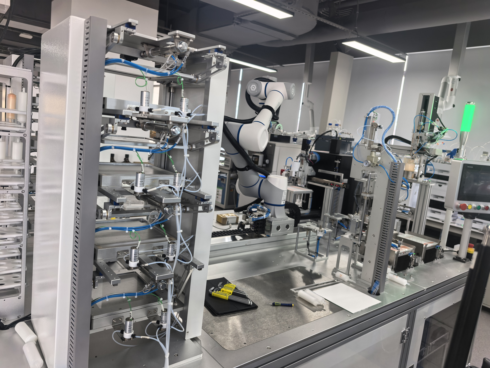
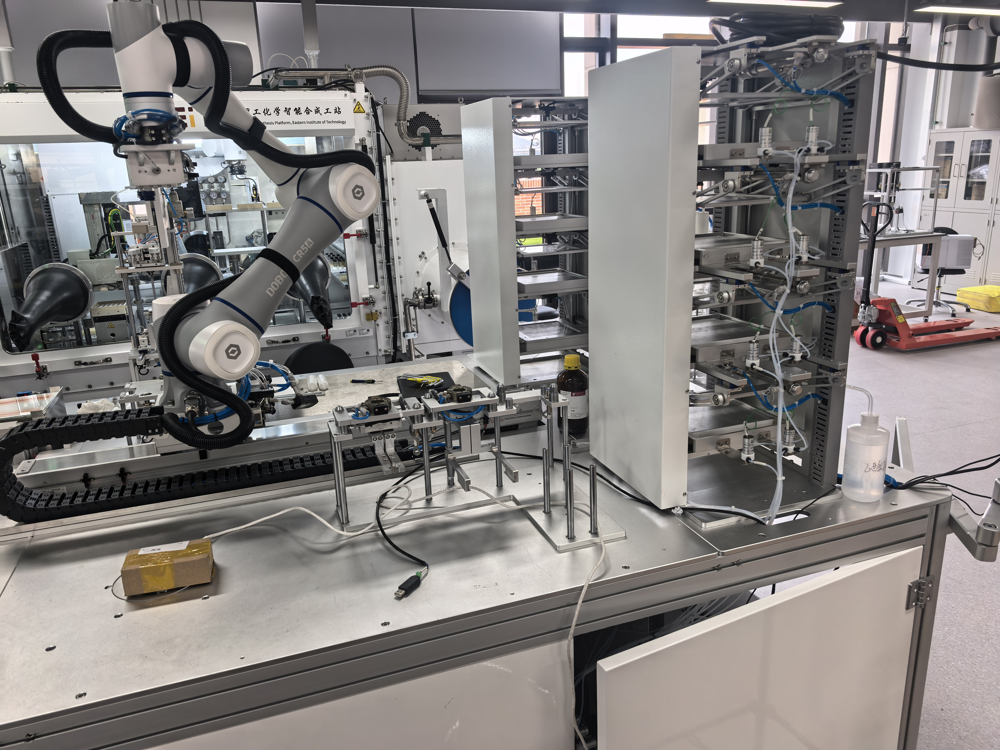
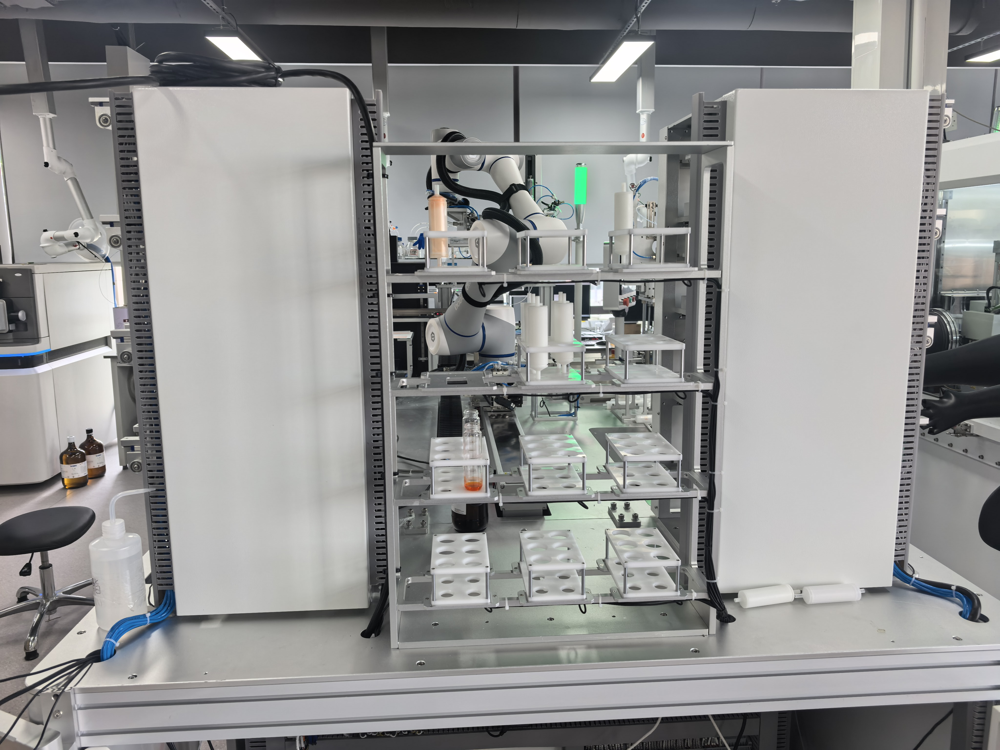
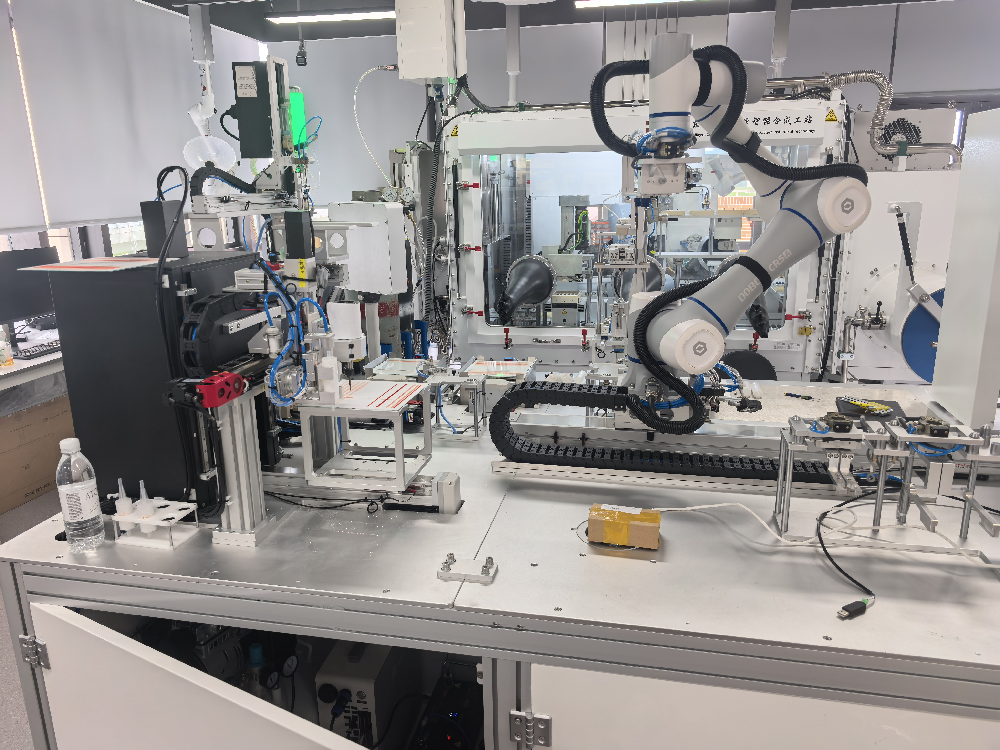

# pTLC 自动化实验室仿真重建基线

> 日期：2026-08-13（Asia/Shanghai）  
> 用途：依据当前 pTLC 上位机代码、只读 API、现场照片和本地 CR5 MoveIt 配置，重建实验室的大致仿真，并确保机械臂—设备交互点位按控制系统原值录入。  
> 本次代码快照：[`Uni-Lab-OS/pTLC_platformUI@c65b34a`](https://github.com/Uni-Lab-OS/pTLC_platformUI/tree/c65b34a8839ebb13fc86701e420b2734d6c4cfa6)，默认分支 `codex/ui-upper-next`，提交时间 2026-07-17。  
> 当前代码真源：`eit_ptlc/config/`；仓库根目录说明明确把 `UI-Upper/` 视为历史归档，不能再作为现行流程依据。  
> 运行时入口：[pTLC 上位机 /points](http://zhlg1509460.bohrium.tech:50001/points)

## 0. 本次仓库核对后的三个直接答案

### 0.1 实验室有哪些仪器

当前代码涉及的物理系统包括：DOBOT CR5A/CR5 机器人、11Y 地轨、三槽快换工具站、FeedLift 双升降轴、上样/点样多轴与注射泵、孔板、PALLASVision 放板纠偏相机、大恒拍照相机、拍照/刮板/CNC 三轴与气动夹具、1–8 号展开缸、8 路液位相机与香橙派、收集工位、4×3 整板货架、暂存 A/B、泵/阀/真空、废板下料侧，以及承载这些工位状态机的 PLC/OPC UA 控制器。完整对应关系见第 6 节。

### 0.2 仪器之间怎样交互

机器人和地轨负责跨工位搬运，PLC L2 动作负责站内气缸、伺服、泵阀和加工动作，相机负责纠偏、拍照、条带识别与液位判断，操作脚本把三者串成受资源锁保护的事务链。主要物流/信息流为：

```text
FeedLift新板
  → 机器人+吸盘 → 上样/点样 → 拍照(before)
  → 展开缸1–8 → 拍照(after)+视觉选带
  → CNC刮取 → 接粉收集器 → 收集工位+收集瓶
  → 暂存/货架；废硅胶板 → FeedLift下料侧

孔板 → 上样泵/点样头 ───────────────────┘
PALLASVision → P86放板纠偏 → P19点样放板
8路液位相机 → 展开完成/排液判断
```

### 0.3 点位是否能进一步帮助仿真

能，而且不仅是“放几个坐标轴”。当前代码把交互点分成四类：机器人目标点、线性进近/退避点、PLC 轴目标/实际位、CNC 机床坐标。它们可以直接帮助构建夹具原点、可达走廊、工具状态机、地轨互锁、视觉纠偏回路和碰撞测试。不能直接得到的仍是实验室世界外参、设备 CAD、真实 TCP 和代码是否已部署到当前 PLC；因此本文把“代码已定义”与“现场已验证”分开标注。

本次根据点位与现场照片 2/3/4 得到两个高置信布局修正：

- `develop_tank_rack` 的两组 1×4 交互面分别在地轨法向两侧，`group_rack_4x3` 位于其轨道末端面；三者是照片 3 所见的同一 U 形组合塔，不是分散的三个机柜。
- `collection_station` 与 `staging_b_6slot` 在轨道法向同侧相邻，点族中心平面距离约 `190.2 mm`；它与展开塔沿地轨相隔约 `1.12 m`，不应相邻或与导轨实体穿插。

照片观察与点位对应已固化在 [`photo_layout_evidence.json`](pTLC仿真资产/photo_layout_evidence.json)，可重复地轨拟合在 [`rail_frame_layout_analysis.json`](pTLC仿真资产/rail_frame_layout_analysis.json)。

## 1. 今天的可交付目标

今天先完成一个“几何近似、点位精确、证据边界清楚”的仿真：

1. 使用 DOBOT CR5A/CR5 机器人骨架和一条水平地轨建立运动链。
2. 按现场照片建立机台、货架、FeedLift、点样、拍照刮板、展开、收集、暂存A/B、工具站和废料区的近似碰撞几何。
3. 将代码中的 **74 条原始机器人记录、12 个网格槽、153 个补充派生点**规范化为 **239 个机器人点**；另导入 **16 个 PLC 语义点记录（18 个标量分量）**。
4. 交互位姿必须逐项使用原始向量，不允许从照片量像素后替换。
5. 在缺失地轨外参、机器人基座外参和 TCP 定义时，只完成局部坐标回放；不得宣称已经获得实验室世界坐标中的精确设备位置。
6. 至少回放“上料→点样→展缸1→拍照刮板→收集→废料”路径，检查 IK、关节分支和碰撞，不连接真实控制接口。

### 今天完成的判据

- [ ] CR5A/CR5 模型能在仿真中正常显示和规划。
- [ ] 地轨被建成独立 prismatic joint，逻辑位 1–6 可切换。
- [ ] 所有关键最终交互点显示为命名坐标轴；原始记录总数核对为 74，P25–P36 网格槽总数核对为 12。
- [ ] 所有进近/退避点显示为路径折线；补充派生点总数核对为 153，规范化机器人点总数核对为 239。
- [ ] PLC 点位核对为 16 个语义记录/18 个标量分量；`sample_5z` 明确标为 pending。
- [ ] 点位回放按“地轨逻辑位 + TCP 点”成对执行。
- [ ] P6、P24、P41、P42 被标红并禁止规划。
- [ ] P64/P65、P73/P74 的重复位姿被显式标记，没有自行“修正”。
- [ ] 仿真成果标注为软件/照片重建，不标注为真机验证。

## 2. 证据等级与使用规则

| 等级 | 含义 | 本文实例 | 仿真中如何使用 |
|---|---|---|---|
| E0C | 当前 Git 提交中的活动配置和流程 | `eit_ptlc/config/points/`、`actions/`、`operation/` | 静态代码真源；不等于已经部署到 PLC |
| E0R | 控制系统运行时直接返回的配置或状态 | 点位 API、动作 API、脚本 API、节点 API | 用于核对当前运行实例；状态只代表读取时刻 |
| E1 | 现场照片直接可见 | CR5A 铭牌、地轨、机架、气动件、瓶架 | 用于外观、相对邻接和近似尺寸 |
| E2 | 本地/官方软件资产 | `cr5_moveit/` 引用 DOBOT 官方 `dobot_rviz` CR5 URDF/STL | 作为可关节运动的机器人骨架；CR5A 等同性未关闭 |
| I | 基于 E0/E1 的推断 | 某未标牌模块对应具体工位、照片比例尺寸 | 作为代理几何并显式携带不确定度，不提升为型号真值 |
| U | 无法获得 | 机台 CAD、基座外参、TCP、精确外形尺寸 | 用户已说明无法现场确认；因此只做局部坐标回放，不宣称实验室世界坐标精确 |

## 3. 最重要的坐标契约

### 3.1 点位不是单独的世界坐标

控制流程表明，交互位姿的完整身份至少是：

```text
(rail_logic_station, robot_point_id, mounted_tool, user_frame, tool_frame)
```

不要只把 `P19` 或 `P71` 的六维向量放到统一世界坐标中。机器人安装在地轨滑台上；同一机器人局部位姿只有和正确的地轨逻辑位组合后才对应实验室中的物理位置。

建议仿真 TF 层级：

```text
world
└── machine_deck
    └── rail_base
        └── rail_carriage              # prismatic joint
            └── robot_base
                └── CR5A links
                    └── flange
                        └── tool/TCP
```

世界位姿应按下式生成：

```text
T_world_tcp =
    T_world_rail_base
  · T_rail_base_carriage(rail_station)
  · T_carriage_robot_base
  · T_robotBase_user0
  · T_user0_tcp(point.pose, tool=1)
```

原始 API 快照中 239/239 条机器人记录都没有 `rail` 字段；地轨位号与点号的绑定来自 operation/任务流程语义，而不是点位 JSON 自带数据。仿真中必须以独立 sidecar 保存这一关联，不得回填或篡改原始快照。利用同一暂存 A 槽的 `P46–P51@rail2=168` 与 `P78–P83@rail3=350` 已能拟合一个相对地轨约束坐标，XY RMS 为 `1.510872 mm`；该坐标精确约束点位的相对布局，但整体世界平移/偏航、TCP 与设备外壳偏置仍不可辨识。可重复分析见 [`rail_frame_layout_analysis.json`](pTLC仿真资产/rail_frame_layout_analysis.json)。

### 3.2 六维向量的原样保存规则

API 返回的 `pose` 统一保存为：

```text
[x, y, z, rx, ry, rz]
```

界面中的位置容差使用 mm、旋转容差使用 deg，DOBOT 控制语义也支持这种表达，因此本文按“平移 mm、姿态 deg”用于仿真初始导入。但 API 没有公开姿态的严格旋转次序/内外旋定义；在通过 DOBOT 控制器或 SDK 文档核验前：

- 必须保存原始三元组；
- 不要提前永久转换成四元数；
- 如果需要临时转换，应把转换函数和旋转次序写入代码并保留可逆路径；
- 用附录中的 `joint` 作为 IK 分支和姿态解释的交叉验证。

`user=0`、`tool=1` 是点位记录中的机器人坐标系编号；它们不等于挂载工具槽位。挂载工具槽位另定义为 0=无、1=吸盘、2=大夹爪、3=小夹爪。

## 4. 已确认的实验室与机器人

这是制备型薄层色谱（pTLC）自动化系统。当前应优先参考 `single_sample_demo`（主 DEMO）和 `ptlc_full_v2`；`ptlc_full.yaml` 已是旧链路，不应用它反向覆盖新流程。主流程：

```text
硅胶板上料
→ 样品孔板吸液与条带点样/吹干
→ 展开前拍照
→ 1–8号展缸显影
→ 展开后拍照与视觉分析
→ CNC刮取目标条带
→ 接粉收集器/收集瓶洗脱收集
→ 成品瓶和耗材回库
→ 废硅胶板下料
```

照片上的机械臂臂体可直接读到 `DOBOT CR5A`；DOBOT 官方 CR A 系列手册给出的型号代码为 `DT-CR050A-0`。本地 [`cr5_moveit/config/cr5_robot.urdf.xacro`](cr5_moveit/config/cr5_robot.urdf.xacro) 是 MoveIt 入口，它引用 [`dobot_rviz/urdf/cr5_robot.urdf`](dobot_rviz/urdf/cr5_robot.urdf)；[`cr5_moveit/config/cr5_robot.srdf`](cr5_moveit/config/cr5_robot.srdf) 定义 `base_link→Link6` 规划组、home 状态和自碰撞豁免。现已从 DOBOT 官方 ROS2 仓库固定提交 `0f67ed9` 补齐 7 个 CR5 STL，因此机器人可按 6 轴关节模型建模，而不是用 Meshy 生成整体外壳。

证据边界：官方 ROS 资产名是 **CR5**，照片和手册型号是 **CR5A**；在无法现场核对的条件下，本项目把前者作为后者的暂定运动学骨架，不能声称几何完全等同。`CR5AF` 属于带力控的 CRAF 系列，**不是** `CR5A`，不得替换。当前官方 CR5 URDF 的关节范围（J3 ±160°、其余约 ±360°）与 CR5A 规格相容，但 URDF 惯性质量合计约 12.48 kg，远小于官方 CR5A 本体 25 kg，故动力学参数也不能当作 CR5A 真值。

## 5. 现场照片与可见结构

### 照片1：机器人、地轨、立式多层机构和右侧气动/伺服模块



可直接确认：CR5A、水平地轨、拖链、大型不锈钢机台、多层气动机构、多个直线模组、气管、信号灯和操作面板。具体立式模块的工位归属仍需结合现场标签确认。

### 照片2：CR5A 铭牌、地轨和两组高层机架



可直接确认：`DOBOT CR5A` 铭牌、末端快换/工具结构、长地轨、两组多层货架/工位塔及大量气缸。该照片支持用 CR5A 加地轨作为仿真主体。

### 照片3：正面瓶架/载架区域



可直接确认：多层瓶/载架、不同孔型载具、至少一瓶有色液体、两侧封闭电控/机构柜。照片能支持近似货架几何，不能提供绝对尺寸。

### 照片4：拍照/刮板侧、机器人和地轨



左侧可见黑色封闭光学/加工模块、直线模组和带标线的平台；中部为 CR5A 和地轨。该区域与网页中的拍照、视觉、刮板/CNC 功能高度一致；由于无法再拍标签，各子模块型号保持未知，只按功能与点位建立几何代理。

### 型号识别、尺寸与 3D 资产路线

| 对象 | 型号判断 | 尺寸依据 | 3D 路线 | 置信边界 |
|---|---|---|---|---|
| 机器人 | **DOBOT CR5A / DT-CR050A-0** | 官方：5 kg 负载、900 mm 工作半径、25 kg 本体、±0.02 mm 重复定位精度 | 本地 MoveIt + 官方 CR5 URDF/STL；不使用 Meshy | 型号高置信；CR5 骨架与 CR5A 几何等同性未证实 |
| HMI 面板 | **WEINVIEW 品牌可读**；具体型号未知，10英寸 MT8102iQ/eMT3105P 仅为外观尺寸候选 | 官方候选面板约 `271×213×32` 或 `286.2×212.8×50 mm`；整套按钮盒代理 `300×120×420 mm` | 通用触屏+按钮盒 | 品牌高置信，型号不得确认 |
| 红色双孔传感器 | 类别候选为双目/双孔 3D 激光轮廓传感器；海康 MV-DP2060-01H 仅为形态/尺寸候选 | 海康官方候选 `120×84×51 mm`，与照片量级相符 | 通用双孔传感器盒体+视锥 | 外壳颜色/细节不吻合且无铭牌，禁止确认型号 |
| PALLASVision | 控制服务名已确认，硬件相机型号未确认 | 软件地址与 P86 纠偏流程 | 相机视锥+通用传感器 | 不把服务名当作相机品牌 |
| 黑色拍照/刮板工站 | 定制 PhotoScrape/CNC 功能区 | 照片4、P63/P64/P65/P76、机床轴语义；估计 `760×650×1050 mm` | 当前代理 GLB/STL；Meshy 首轮候选仅替换 visual | 外形中等置信，交互点取控制器原值 |
| 其余机台/货架/升降/展缸/收集 | 多为定制集成设备，未发现可确认商品型号 | 照片比例 + 点阵槽距 + CR5A 900 mm 尺度先验 | 参数化简单几何 | 尺寸均带 `uncertainty_mm`，不冒充实测 |

可执行资产清单见 [`pTLC仿真资产/asset_manifest.json`](pTLC仿真资产/asset_manifest.json)，代理构建说明见 [`pTLC仿真资产/README.md`](pTLC仿真资产/README.md)。已为 12 个主场景设备/区域和 3 个工具生成 visual GLB 与独立 collision STL；用户指定不需要的 `rear_chemistry_workstation` 已从活动清单和场景排除，旧代理仅留在 `excluded/` 可恢复归档。全部精确控制点另存于 [`pTLC仿真资产/interaction_points.json`](pTLC仿真资产/interaction_points.json)，代理尺寸不会回写点位。碰撞几何已通过 [`collision_qc_report.json`](pTLC仿真资产/collision_qc_report.json) 检查：15/15 水密且外包络尺寸匹配，8 个开放工站/货架均以多闭合子体保留空腔；导入会自动凸包化 STL 的引擎必须按连通壳拆成 compound collision。

已生成点位约束+照片校准的 layout v2：[`lab_scene_approx.glb`](pTLC仿真资产/lab_scene_approx.glb) 和 [`俯视预览`](pTLC仿真资产/lab_scene_approx_top.png)。场景放置 15 个活动代理资产，并加入 CR5 URDF 的 7 个视觉 STL、13 个拟合 TCP 点族中心标记和 4 组不同地轨值标记；GLB 回读为 215 个几何体，场景包围约 `4.6×2.8×1.92 m`、米制、Z-up。展开缸双塔与 4×3 货架已组成轨道末端 U 形组合塔；收集站与暂存 B 相邻，不再与展开塔/地轨实体错误重叠。组件级布局检查见 [`layout_collision_qc.json`](pTLC仿真资产/layout_collision_qc.json)：0 个非预期交叠，3 组有意嵌套。`lab_from_controller_transform=null` 仍保留；场景显示的是拟合后的地轨相对约束标记，不是冒充世界外参的 239 个原始点。

Meshy 策略：先用照片4中的黑色定制 PhotoScrape 工站做单对象视觉外壳测试，输出只作为 `visual`；机器人、地轨、碰撞体和交互坐标均不交给 Meshy。用户已授权使用 API 做测试和分析，但本地 3D 资产 skill 还要求明确的“单设备积分上限”；建议首轮 30 credits。当前零付费 API 连通性检查超时，没有创建任务、没有消耗积分。pipeline 的 SQLite 里只有早期导入且研究失败的 `DOBOT CR5A` 记录，没有 approval/task/artifact；机器人已经走官方 URDF/STL 路线，不得为它续提 Meshy 任务。

## 6. 设备清单与仿真抽象

| 设备/区域 | 当前代码实体与点位 | 与其它仪器的交互 | 仿真抽象与证据边界 |
|---|---|---|---|
| PLC/OPC UA 控制器 | `192.168.0.50:4840`；Sampling、Develop、Collect、PhotoScrape、FeedLift、Pump、Rail、StagingA 的 L2 FSM | 接收上位机动作码与目标值，反馈 Busy/Done/Error 和 ActPos；不直接代表设备几何 | 仿真为有限状态机和 I/O，不宣称当前 PLC 已部署同一提交 |
| DOBOT CR5A | 74 条原始点、规范化后 239 点；20 个机器人动作 | 负责全部板、整板载架、收集器和瓶的跨站搬运 | 本地 MoveIt + 官方 CR5 6轴 URDF/7个STL；作为 CR5A 暂定骨架，不用 CR5AF |
| 11Y 地轨 | `rail.move`；逻辑位 1–6；`Rail_ActPos` 明确按 mm | 承载机器人跨区移动；移动前 `rail_move_safe` 要求机器人位于 P1 | 1 个 prismatic joint；6 个代码站位仍需测世界零点 |
| 工具更换站 | P2、P8/P9/P10；工具 0/1/2/3=无/吸盘/大夹爪/小夹爪 | 地轨位 4 换刀；吸盘有真空时禁止换刀 | 3 个工具碰撞模型、快换锁和持料状态 |
| FeedLift 上料/下料 | 1Z/2Z 光电搜索边界；P21 新板、P22 废板 | 1Z 顶升新板供吸盘取；2Z 接废板并埋料至光电消失 | 双升降轴+板堆+光电；0/512 仅作行程代理，不作为真实搜索边界 |
| 上样/点样工位 | 4X、3Y、5Z、6X/7Y；P19 放板、P20 取板 | 机器人放板后定位；注射泵从孔板吸液，点样头做条带点样/吹干 | 板夹具+5 个运动语义轴；5Z 节点仍 pending |
| 样品孔板 | `4×6`、`6×8`；按三点仿射寻孔 | 为 Sampling 提供样液，不由机器人逐孔操作 | 两块 4×6 已有三点标定；两块 6×8 尚未标定 |
| PALLASVision 放板纠偏 | P86；TCP bridge `192.168.0.168:18889`；补光 DO7 | 机器人持板在 P86 先修 Rz、再拍一次修 XY，之后才到 P19 | 相机视锥+两次测量回路；阈值 XY 30 mm、Rz 10° |
| 大恒拍照相机 | `192.168.0.169`；before/after 图；UV Line1 | PhotoScrape 移到 8Y 拍照位后采集，视觉模块输出条带候选 | 固定相机+遮光/UV 状态；相机外参仍缺失 |
| 拍照/刮板/CNC | P64/P65 板夹具，P68/P77 接粉夹具；9X/8Y/10Z、真空、翻料、定位/下压气缸 | 视觉选带→生成 CNC 路径→人工门确认→PLC 刮取，粉末落入收集器 | 盒体+板夹具+接粉夹具+刀头三轴；机床坐标不能当机器人坐标 |
| 1–8 号展开缸 | P11–P18；目标缸 `1..8`；开盖/关盖、清洗、润洗、上液、排液 | 机器人放取板；泵阀送液；液位模块判断展开/排液 | 8 个缸体、盖、板夹具和液位状态 |
| 8 路液位相机/香橙派 | `192.168.0.60`；`/dev/camera1..8`；MQTT/MJPEG | 每路对应展开缸监控；上位机拉帧判断液位/前沿 | 8 个传感器 frustum；监控 640×480，活动检测 1920×1080；`auto_start=false` |
| 泵/阀/真空 | Sampling/Develop/Collect 泵参数及 `pump.vacuum_on/off` | 与点样、展缸、洗脱和刮取按脚本互锁 | 流体状态机；首轮不建内部管路几何 |
| 收集工位 | P71/P72 瓶，P73/P74 收集器；夹持、伸缩、升降、下压、洗脱 | 从刮板取接粉器，从暂存 B 取瓶，完成加液/排液后分别退回 | 两个交互夹具+气缸+液路状态 |
| 4×3 整板货架 | P25–P36 仿射网格，地轨位 6 | 大夹爪搬接粉器整板/瓶整板到组暂存 | 12 槽网格；以 P25/P34/P36 为三锚点 |
| 组暂存区 | P37/P39 收集器整板放/取；P38/P40 瓶整板放/取 | 连接整板货架与单件暂存区 | 两个整板载台，地轨位 3 |
| 暂存 A | P46–P51 取料（地轨位 2）；P78–P83 回料（地轨位 3） | 小夹爪向刮板供/回收集器；LocatorA 定位整板 | 同一物理槽的两套地轨补偿点，不能互换 |
| 暂存 B | P53–P58，地轨位 3 | 小夹爪向收集工位供/回收集瓶；LocatorB 定位瓶板 | 6 槽瓶架；没有独立的 StagingB PLC FSM |
| 废板下料侧 | P22 + `feedlift.unload_ready/unload_bury` | 吸盘把刮后废板交给 FeedLift 2Z | 废板槽+升降动作；代码标签 `waste` 不等于独立 PLC 工位 |

## 7. 机械臂主任务链

### 7.1 控制层关系

仓库静态扫描得到 81 个原子动作和 85 个 operation 脚本。它们的关系不是“机器人直接驱动所有设备”，而是：

```text
操作配方 / single_sample_demo
  └─ operation 脚本（资源锁、条件、人工门、异常收尾）
      ├─ robot actions → Dobot TCP → CR5A + 工具 DO/DI
      ├─ plc_l2 actions → OPC UA → 各工位 FSM/伺服/气缸/泵阀
      ├─ camera/vision → 大恒相机、PALLASVision、CNC 路径
      └─ host actions → 液位等待、参考图、CNC 对位读数
```

`single_sample_demo` 同时锁定 `robot`、地轨、FeedLift、Sampling、PhotoScrape、Develop、Collect、暂存 A/B、接粉夹具、收集夹具/瓶等资源，防止相互冲突的脚本并发占用同一实体。

### 7.2 当前单样品闭环

1. `robot_startup_check`：只校验机器人安全态/P1，不自动回零。
2. `robot_tool_ensure(1)`：读取持久化挂载工具状态；需要换刀时先经 `rail_move_safe(4)` 到工具站。吸盘仍有真空时禁止换刀。
3. `feedlift_load_cycle`：安全移轨到位 1；1Z 搜索光电边沿；机器人经 P5 和两段进近到 P21 取新板。
4. `sampling_load`：经 P4 到 P86，先做 Rz 纠偏、再做 XY 纠偏，然后在 P19 放板并由 Sampling 定位夹紧。
5. `sampling_execute`：由孔板规格/盘号/孔位三点仿射生成 4X/3Y 目标，吸液后沿 `spot_pose` 的 6X/7Y 条带点样并吹干；P20 取板。
6. 展开前拍照：安全移轨到位 2，在 P65 放板、8Y 到拍照位、获取 before 图，再从 P64 取板。
7. `develop_cycle(tank)`：安全移轨到位 5，经 P3 和目标缸的 far/mid/near 路径把板放到 P11–P18；泵阀/液位闭环结束后取回。
8. 展开后拍照：回位 2，在 P65 放板，获取 after 图并做条带识别/CNC 候选路径。
9. 换大夹爪：位 6 从 P25–P36 取接粉器整板/收集瓶整板，位 3 放到组暂存；StagingA 的 LocatorA/LocatorB 分别定位暂存 A/B。
10. 换小夹爪：在地轨位 2 从 P46–P51 取一个接粉收集器，经 P68 放入刮板夹具；夹具压紧后机器人释放。
11. PhotoScrape：相机/视觉/人工门确认路径，PLC 完成 CNC 刮取和翻料；粉末落入接粉器。
12. Collect：从 P77 取接粉器，地轨位 3 后在 P73 放收集器；从 P53–P58 取瓶并在 P71 放瓶；夹紧、伸缩、升降/下压、加液/排液洗脱。
13. P72 取成品瓶回暂存 B；P74 取收集器，通过 **P78–P83（地轨位 3）** 回暂存 A。P46–P51 是地轨位 2 的取料点，不能拿来替代回料点。
14. 换回吸盘，在 P64 取废板，安全移轨到位 1，经 P5/P22 交给 FeedLift 2Z 下料并埋料。

### 7.3 工具与 I/O 关系

| 工具/执行器 | 代码状态 | 主要用途 | 仿真事件 |
|---|---|---|---|
| 无工具 | `mounted_tool=0` | 空腕/初始化 | TCP 不可用，禁止抓放 |
| 吸盘 | slot 1；DO3=1 真空、0 关闭 | 硅胶板搬运 | attach/detach plate；真空保持门 |
| 大夹爪 | slot 2；`gripper-open/close`，基线 DO2：1 夹/0 松 | 整板载架搬运 | attach/detach rack |
| 小夹爪 | slot 3；`gripper-open/close`，基线 DO2：1 夹/0 松 | 收集器、收集瓶 | attach/detach small item |
| 快换锁 | DO1：0 锁紧、1 释放 | 三工具装卸 | tool fixed joint 状态切换 |
| 工具辅助线 | DO6：1 开/0 关；具体双义由挂载工具门控 | 快换辅助/双气工具动作 | 只模拟 `tool_action` 语义，不绕过驱动直接猜电平 |
| PALLAS 补光 | DO7 | 纠偏识别 | light on→settle→capture→finally off |

## 8. 关键交互点位语义

下表是建模时最先放置的最终目标/锚点。数值真源、派生规则和货架网格见附录 A–C。

| 地轨逻辑位 | 区域 | 点位 | 语义 | 工具/动作 |
|---:|---|---|---|---|
| 任意安全切换前 | 全局 | P1 | Home；地轨移动前的安全锚点 | 所有工具 |
| 4 | 工具站 | P2 | 工具区准备点 | 快换 |
| 4 | 工具站 | P8 / P9 / P10 | 吸盘 / 大夹爪 / 小夹爪安装目标 | 快换锁/释放 |
| 5 | 展开区 | P3 | 展缸区过渡锚点 | 吸盘 |
| 5 | 展开区 | P11–P18 | 1–8号展缸最终放取板点 | 吸盘开/关 |
| 脚本上下文 | 点样区 | P4 | 点样相关过渡锚点；点本身未写 rail | 吸盘 |
| 1 | 点样区 | P19 | 放板到点样夹具 | 吸盘关 |
| 1 | 点样区 | P20 | 从点样夹具取板 | 吸盘开 |
| 脚本上下文 | 视觉 | P86 | 放板前 PALLAS 两次 Rz/XY 纠偏；点本身未写 rail | 吸盘持板 |
| 1 | FeedLift/废料 | P5 | 上下料过渡锚点 | 吸盘 |
| 1 | FeedLift | P21 | 吸取新硅胶板 | 吸盘开 |
| 1 | 废料 | P22 | 放置废硅胶板 | 吸盘关 |
| 6 | 货架 | P7 | 货架过渡锚点 | 大夹爪 |
| 6 | 货架 | P25–P36 | 4×3整板货架12槽 | 大夹爪 |
| 3 | 组暂存 | P37 / P39 | 收集器整板放 / 取 | 大夹爪 |
| 3 | 组暂存 | P38 / P40 | 瓶整板放 / 取 | 大夹爪 |
| 脚本上下文 | 暂存A | P45 | 单收集器区过渡锚点；点本身未写 rail | 小夹爪 |
| 2 | 暂存A | P46–P51 | 从暂存 A 取收集器的槽1–6 | 小夹爪 |
| 3 | 暂存A | P78–P83 | 收集结束后放回暂存 A 的槽1–6 | 小夹爪 |
| 3 | 暂存B | P52 | 单瓶区过渡锚点 | 小夹爪 |
| 3 | 暂存B | P53–P58 | 单瓶槽1–6 | 小夹爪 |
| 2 | 拍照刮板 | P63 | 硅胶板夹具过渡锚点 | 吸盘 |
| 2 | 拍照刮板 | P64 | 从刮板工位取板 | 吸盘开 |
| 2 | 拍照刮板 | P65 | 放板到刮板工位 | 吸盘关 |
| 2 | 接粉夹具 | P67 | 接粉夹具过渡锚点 | 小夹爪 |
| 2 | 接粉夹具 | P68 | 放接粉收集器 | 小夹爪保持，气缸夹紧后松爪 |
| 2 | 接粉夹具 | P77 | 取接粉收集器 | 小夹爪 |
| 3 | 收集工位 | P70 | 收集区过渡锚点 | 小夹爪 |
| 3 | 收集工位 | P71 / P72 | 放瓶 / 取瓶 | 小夹爪 |
| 3 | 收集工位 | P73 / P74 | 放收集器 / 取收集器 | 小夹爪 |

### 8.1 点位类型如何帮助仿真

| 点位类型 | 代码例子 | 仿真用途 | 不能据此断言 |
|---|---|---|---|
| Home/ready 锚点 | P1、P2、P3、P4、P5、P7、P45、P52、P63、P67、P70 | 定义跨区域的自由空间节点和状态机入口 | API 点本身无 rail 字段；若工作流 sidecar 也未绑定，就不能单独变成约束坐标 |
| 最终目标 | P8–P22、P37–P40、P46–P58、P64/P65、P68、P71–P74、P77–P83 | 反推夹具 TCP 接触面、抓放姿态和物体 attach/detach 时刻 | 目标位姿不是设备外形尺寸 |
| 派生进近/退避 | 153 个 supplement 点 | 形成碰撞通道和 MoveL 折线；校验 far→mid→near→target 顺序 | 是 offset 规则，不是 153 次独立现场示教 |
| 货架仿射槽 | P25–P36 | 以三锚点构造 4×3 库位平面；每格保留小偏置 | 不能把 12 格简化为等距后丢弃 offset |
| 视觉修正点 | P86 + 动态 `dx_mm/dy_mm/drz_deg` | 建立名义位姿与运行时修正位姿两层 Marker | 修正只服务 P19 放板，不是相机外参标定 |
| PLC 目标/实际位 | `*_Target` / `*_ActPos` | 建立机构关节、到位反馈和软限位 | 只给一维轴值，不能决定设备在 world 中的朝向 |
| CNC 机床点 | `plate_origin_*`、Align Target/ActPos、`g_sx/g_sy/g_sz` | 建立板面、刀头路径、Z 门和板区软限位 | 与机器人 `pose` 不同坐标系，禁止混表 |

### 8.2 各工位的交互点位与进一步帮助

| 工位 | 机器人/地轨交互点 | 站内点位或传感器 | 对仿真重建的具体帮助 | 仍缺什么 |
|---|---|---|---|---|
| 工具站 | rail 4；P2；P8/P9/P10 + 3 个 approach | 快换 DO1、工具 DO/DI、持久化 mounted_tool | 建工具槽间距、换刀进近轴、工具碰撞体和“吸着板禁止换刀”门 | 各工具 flange→TCP 外参 |
| FeedLift | rail 1；P5→far→near→P21/P22 | 1Z/2Z ActPos、光电搜索 low/high | 建双升降轴、板堆高度搜索和取/放事件 | low/high 当前 0/512 是待重示教初值 |
| 上样/点样 | rail 1；P4/P86/P19/P20 | 4X/3Y 孔位、5Z、6X 起止、7Y 高度、定位气缸 | 孔板→吸液→条带点样的完整运动链；P86 形成动态纠偏层 | 6×8 标定缺失；5Z pending；P4/P86 rail 未显式登记 |
| 展开 | rail 5；P3；P11–P18 各 3 段 approach | `target_tank=1..8`、盖/板气缸、液位相机、泵阀 | 可把 8 缸布成两列四层，并以实际 TCP 轨迹校核开口通道 | 缸体 CAD、相机外参、液位/前沿真机阈值 |
| 拍照/刮板 | rail 2；P63/P64/P65；P67/P68/P77 | photo 8Y=420；CNC 9X/8Y/10Z；定位/下压/接粉气缸 | 同时确定板夹具与接粉夹具的交互面、相机拍照位、刀头检查位和刮取路径 | 代码已定义动作 42/43/44，但当前 PLC 是否已下载未核验 |
| 整板货架/组暂存 | rail 6 + P25–P36；rail 3 + P37–P40 | 4×3 仿射网格、LocatorA/B | 可重建货架层/列关系和两种耗材整板物流 | 槽宽、板尺寸、货架相对 world 外参 |
| 暂存 A | rail 2 取：P46–P51；rail 3 回：P78–P83 | LocatorA | 揭示同一物理槽存在两套“地轨+机器人”补偿点；可用于校核地轨外参一致性 | 无现场数据时分别保留，不强制世界重合 |
| 暂存 B | rail 3；P52/P53–P58 | LocatorB（仍由 StagingA L2 控制） | 建 6 槽瓶架和收集工位补给关系 | 没有独立 StagingB FSM；不能虚构一个 PLC 工位 |
| 收集 | rail 3；P70/P71–P74 | 夹持、伸缩、升降、下压、洗脱泵 | P73/P74 同位姿但气缸/物料状态不同，适合建离散事件仿真 | 夹具/瓶/接粉器 CAD 与流体参数真值 |

### 8.3 三个特别有价值的动态交互点

1. **P86 不是普通静态点**：机器人到 P86 后驻留 300 ms，第一次视觉只修 `drz_deg`；再驻留 300 ms，第二次检查残余 Rz（阈值 0.8°）并修 `dx_mm/dy_mm`。识别错误 111 只允许人工确认后再拍一次，仍失败则中止。仿真应保存 `P86_nominal`、`P86_rz_corrected`、`P19_xy_corrected` 三层轨迹。
2. **P46–P51 与 P78–P83 是同槽不同地轨组合**：前者在 rail 2 取料，后者在 rail 3 回料。它们可以用来估计/验证“地轨平移与机器人 X 补偿”是否让 TCP 落在同一物理槽，但在外参测出前不能直接合并。
3. **P64/P65、P73/P74 的同位姿是状态差异，不是坐标错误**：取/放动作由吸盘/夹爪、定位气缸、下压/夹持状态和动作顺序区分。离散事件状态必须和几何位姿一起建模。

## 9. 地轨与PLC伺服点位

### 9.1 地轨逻辑位

| 位码 | 功能 | 当前PC真源值 | 建模解释 |
|---:|---|---:|---|
| 1 | 上样/FeedLift | 168.0 | 逻辑位1 |
| 2 | 拍照/刮板 | 168.0 | 与位1当前数值相同，保留不同语义 |
| 3 | 收集/暂存 | 350.0 | 逻辑位3 |
| 4 | 工具更换 | 500.0 | 逻辑位4 |
| 5 | 展开 | 600.0 | 逻辑位5 |
| 6 | 仓库 | 600.0 | 与位5当前数值相同，保留不同语义 |

注意：当前代码在 `Rail_ActPos`、同步阈值和站点表中已经明确把这些值按 **mm** 处理，范围 0–3000；但地轨世界零点和机械安装外参仍未获得。位 1=位 2、位 5=位 6 表示代码当前将它们映射到同一轴位置、保留不同业务语义；禁止自行改值，也不要据此假设两个业务工位的所有设备几何都重合。

### 9.2 PLC点位完整表

<!-- PLC_POINTS_BEGIN -->

| 工位 | 类别 | ID | 标签 | 值 | 节点/实际位 | 限位 | 状态 |
|---|---|---|---|---|---|---|---|
| FeedLift | 标量 | `feedlift_1z_search_low` | 1Z 光电搜索下界 | 0.0 | `FeedLift_1Z_SearchLowTarget / FeedLift_1Z_ActPos` | -50..550 mm | 初值；仿真行程代理 |
| FeedLift | 标量 | `feedlift_1z_search_high` | 1Z 光电搜索上界 | 512.0 | `FeedLift_1Z_SearchHighTarget / FeedLift_1Z_ActPos` | -50..550 mm | 初值；仿真行程代理 |
| FeedLift | 标量 | `feedlift_2z_search_low` | 2Z 光电搜索下界 | 0.0 | `FeedLift_2Z_SearchLowTarget / FeedLift_2Z_ActPos` | -50..550 mm | 初值；仿真行程代理 |
| FeedLift | 标量 | `feedlift_2z_search_high` | 2Z 光电搜索上界 | 512.0 | `FeedLift_2Z_SearchHighTarget / FeedLift_2Z_ActPos` | -50..550 mm | 初值；仿真行程代理 |
| 拍照 | 标量 | `photo_8y` | 拍照 8Y | 420.0 | `Photo_8Y_Target / Photo_8Y_ActPos` | -500..500 mm | ready |
| 地轨 | 槽位 | `rail_p1_sampling` | 1-上样 | 168.0 | `Rail_Pos_Target[1] / Rail_ActPos` | 0..3000 mm | ready |
| 地轨 | 槽位 | `rail_p2_photo` | 2-拍照 | 168.0 | `Rail_Pos_Target[2] / Rail_ActPos` | 0..3000 mm | ready |
| 地轨 | 槽位 | `rail_p3_collect` | 3-收集 | 350.0 | `Rail_Pos_Target[3] / Rail_ActPos` | 0..3000 mm | ready |
| 地轨 | 槽位 | `rail_p4_tool` | 4-工具 | 500.0 | `Rail_Pos_Target[4] / Rail_ActPos` | 0..3000 mm | ready |
| 地轨 | 槽位 | `rail_p5_expand` | 5-展开 | 600.0 | `Rail_Pos_Target[5] / Rail_ActPos` | 0..3000 mm | ready |
| 地轨 | 槽位 | `rail_p6_store` | 6-仓库 | 600.0 | `Rail_Pos_Target[6] / Rail_ActPos` | 0..3000 mm | ready |
| 上样 | 标量 | `sampling_4x` | 4X 仿射/限位源 | 0.0 | `Sampling_4X_Target / Sampling_4X_ActPos` | -5..110 mm | 运行时按孔位覆盖 |
| 上样 | 标量 | `sampling_3y` | 3Y 仿射/限位源 | 0.0 | `Sampling_3Y_Target / Sampling_3Y_ActPos` | -20..245 mm | 运行时按孔位覆盖 |
| 上样 | 标量 | `sample_5z` | 5Z 升降 | 0.0 | `Sampling_5Z_Target / Sampling_5Z_ActPos` | -5..50 mm | **pending：PLC 节点待建** |
| 上样 | 标量 | `sampling_4x_wash` | 4X 清洗位 | 0.0 | `Sampling_4X_WashTarget / Sampling_4X_ActPos` | -5..110 mm | 待示教值 |
| 点样 | 复合 | `spot_pose` | 条带点样位置 | X起 70；X止 240；Y -20 | `Spot_6X_StartTarget/EndTarget、Spot_7Y_Target / 对应 ActPos` | 各 -500..500 mm | ready；运行时可覆盖 |

<!-- PLC_POINTS_END -->

因此“16 个 PLC 点”是 UI/配置层的语义记录数；`spot_pose` 内含 3 个标量，所以实际需要在仿真中建立 18 个目标标量。布尔定位目标、动作码以及 CNC 数组不计入这 16 个点，但必须进入交互状态机。

### 9.3 上样孔板标定点

| 孔板实例 | 标定状态 | 三点标定 `(well → x,y mm)` | 仿真用途 |
|---|---|---|---|
| 4×6 #1 | 已配置 | A1→(23.0,-18.7)，A6→(23.0,71.3)，D1→(50.0,-18.7) | 解 4X/3Y 仿射面，生成 24 个孔中心 |
| 4×6 #2 | 已配置 | A1→(78.5,-18.7)，A6→(78.5,71.3)，D1→(105.5,-18.7) | 解第二块 4×6 孔板的 24 个孔中心 |
| 6×8 #1 | 未标定 | 空 | 禁止生成 48 孔真值；只可显示占位网格 |
| 6×8 #2 | 未标定 | 空 | 禁止生成 48 孔真值；只可显示占位网格 |

4×6 的 `nominal_pitch_x/y=19.3 mm` 只用于偏差自检，不参与最终算点；最终轴值来自每块孔板的三点标定。

### 9.4 PhotoScrape CNC/对位点位

这部分是新仓库对仿真最有帮助、也最容易混淆的新增信息。它属于 **机床坐标系**：

| 参数/点位 | 当前代码值 | 仿真含义 | 证据边界 |
|---|---:|---|---|
| 板面左下角 | X=91.24，Y=-75.2 mm | 图像 `rot0/lower-left` 与机床 XY 的锚点 | 代码当前配置；原样使用但标记未复测 |
| 板表面 Z | 20.5 mm | 刮取深度的基准面 | 不等于机器人 P65 的 Z |
| 对位检查 Z | 18.0 mm | `20.5 - 2.5`，刀头缓降检查高度 | 只允许在 XY 板区窗内下降 |
| 机床 Y 软下限 | -73 mm | 防止刀头接近底边撞机 | 生成路径时会截平越界部分 |
| 刀径 | 2 mm | 轮廓路径刀补 | 当前工艺配置，不是 CAD 测量 |
| 刀头—收集器 X 偏置 | 90 mm | 刮刀与粉末收集口的相对补偿 | 当前配置标作实测；无法再独立复测 |
| 收集器 Y 偏置 | -3 mm | 粉末收集口横向补偿 | 同上 |

对位操作使用 9X/8Y/10Z 的 Target/ActPos：动作 42 只在 Z=0 时移动 XY 且检查板区软窗；动作 43 先升 Z 再 XY 回零；动作 44 的 Z 只能是安全高 0 或检查高约 18 mm，并且只有 XY 位于板区窗内才允许下降。**仓库提交说明和上位机动作已包含 42/43/44，但仅凭 Git 不能证明当前 PLC 已下载同版程序；在部署记录确认前，仿真可建、真机禁发。**

## 10. 仿真搭建顺序

### G0：锁定坐标解释

- [x] 原样保存 DOBOT `pose=[x,y,z,rx,ry,rz]`、`joint`、`user`、`tool`，不提前永久转换旋转表示。
- [x] 将 `user=0`、`tool=1` 的控制器实际定义标记为未知，不以猜测值填入。
- [x] 将 tool1 TCP 相对 flange 外参设为 `unknown`；只在机器人局部坐标回放。
- [x] 三个工具共享/切换补偿机制标为未知；各自 collision 采用带不确定度的代理。

### G1：建立世界和地轨

- [x] 仿真整体 world 仅作展示规范；场景内部使用拟合的 `rail_constraint_frame`，不声称对应现场测绘基准。
- [x] 地轨方向/尺度由暂存 A 六对同槽点拟合，设备主体偏置由照片观察面决定；证据状态分别为 `point_fitted_relative` 与 `photo_surface_prior`。
- [x] 地轨位1–6保留网页值 168/168/350/500/600/600，独立保存 `as_configured` 状态。
- [x] `rail_carriage→robot_base` 采用零旋转的安装代理；外参状态为 `unknown`。

### G2：机器人模型与工具

- [x] 已补齐本地 `cr5_moveit` 所需的官方 CR5 `dobot_rviz` URDF 与 7 个 STL，并收窄安装脚本以匹配最小描述子集。
- [x] 已确认照片/铭牌为 CR5A、官方型号代码 `DT-CR050A-0`；CR5 骨架等同性保留为未证实。
- [ ] 增加地轨 joint，并避免把机器人基座固定到 world。
- [x] 已为三种工具生成 visual/collision 代理；TCP 保持未知。

本机没有 ROS2、Xacro、MoveIt 和 `check_urdf`，所以“补齐”仅指描述文件路径闭包、XML 语法、网格引用与哈希通过；尚未完成 RViz 显示、Xacro 展开、FK/IK 或轨迹规划验证。当前 `ros2_control` 配置使用 `mock_components/GenericSystem`，不是真机硬件插件。

### G3：近似场景几何

先用包围盒，不等待精细CAD：

- 机台台面；
- 左右大型电控/机构柜；
- 8缸/多层展开机构；
- 4×3整板货架；
- 暂存A/B载架；
- FeedLift；
- 点样夹具；
- 拍照刮板/CNC箱体；
- 收集工位；
- 工具架；
- 废料槽。

每个碰撞体必须带 `evidence=photo_approx` 或等价标签，避免以后误认成CAD真值。

### G4：点位导入和可视化

- 最终交互点：红色坐标轴。
- approach/retreat：黄色坐标轴和折线。
- Home/ready锚点：蓝色坐标轴。
- 视觉动态修正点：紫色名义点 + 绿色运行时修正点，不覆盖名义值。
- PLC Target/ActPos：在设备局部轴上分别显示半透明目标与实心反馈。
- CNC 路径：只挂在 `photoscrape_machine` 坐标系，不挂在 `robot_base`。
- placeholder：红色叉号，规划黑名单。
- 每个Marker名称同时显示 `P编号/语义ID/地轨位`。
- 先验证附录A的关节值是否能正解回对应pose，再做逆解。

### G5：路径回放

推荐最小闭环：

```text
rail1 + P1→P5→P21
rail1/2 + P4→P86→P19→P20
rail2 + P63→P65→P64
rail5 + P3→tank.1.approach_far→mid→near→P11
rail2 + P67→scrape-holder-put.*→P68
rail3 + P70→P71/P72→P73/P74
rail3 + P70→P45→staging-a-return.p78.high→near→P78
rail1 + P5→waste.approach_far→near→P22
```

通过标准：

- 有IK解；
- 解与记录的joint分支接近；
- 线性进近段不穿过设备包围盒；
- 地轨移动前机器人位于P1；
- 吸盘/夹爪开合顺序与任务脚本一致；
- 不发送任何真实设备命令。

## 11. 无法现场确认后的替代策略

用户已明确说明不能做现场确认，因此下列原本需要实测的量不再作为今天的阻塞项，而是转为“未知参数 + 可替代的建模约束”。这使仿真能用于布局、任务逻辑、点位局部回放和视觉展示，但不能用于真机碰撞安全证明。

| 缺失真值 | 当前替代 | 允许的用途 | 禁止的结论 |
|---|---|---|---|
| 地轨世界零点、robot_base 安装外参 | 任意世界原点 + 照片相对布局 + 网页地轨站点值 | 展示工作区、局部路径、站点切换 | 设备在真实实验室世界中的毫米级位置 |
| user0/tool1 与三个工具 TCP | 原始控制器记录独立保存；代理 TCP 标 `unknown` | 点位数据检查、关节分支比较 | 真实末端可达/无碰撞认证 |
| 机台/外壳/CAD 尺寸 | CR5A 900 mm 半径作尺度先验，结合照片比例、点阵槽距和常见板/瓶尺寸 | 简化 visual/collision、场景占位 | 商品型号尺寸或实测尺寸 |
| 各夹具基准 | 以 P 点族的相对几何反推槽距和工位拓扑 | 建立交互面与进近通道 | 外壳表面与 TCP 在世界坐标精确对齐 |
| FeedLift 真实搜索边界 | 0/512 只作为行程代理 | UI/机构动画 | 真实设备安全边界 |
| 6×8 孔板标定 | 保留为空，不生成点 | 显示未标定载具 | 精确 96 孔吸液路径 |
| PLC 42/43/44 部署版本 | 只使用 Git 动作定义建状态机 | 离线流程仿真 | 当前 PLC 已部署或可安全下发 |

所有未知外形在 [`asset_manifest.json`](pTLC仿真资产/asset_manifest.json) 中都有 `uncertainty_mm`。交互点则来自独立快照，不因代理网格缩放、Meshy 结果或视觉“贴合”而改变。

## 12. 已知异常、禁用点和不可越过的证据边界

1. **占位点**：P6、P24、P41、P42 的pose均为 `[0,-246,1047,-90,0,180]`，状态为 `placeholder`，禁止用于真实规划。
2. **重复最终位姿**：
   - P64与P65完全相同，但流程语义分别是刮板取板/放板；
   - P73与P74完全相同，但流程语义分别是收集器放/取；
   不得擅自偏移。
3. **派生点不是现场独立示教**：165个派生点来自基础点加offset/仿射规则；它们应保留来源ID。
4. **validated不是今天的真机验证**：235个点标为 `validated`，仅代表控制配置中的状态。
5. **网格/派生口径**：74 是 `robot_points.json` 当前记录数；P25–P36 已迁入 `meta.grids`，加 12 网格槽和 153 supplement 后运行时共 239 点。165 个 `derived_from!=null` 点包含 12 个网格槽，不是 165 个进近点。
6. **API 中 239 个点全部没有 rail 字段**：工位地轨绑定来自操作流程语义 sidecar；必须同时保存点位快照与关联的来源，不得将其伪装成点 JSON 原生字段。未被操作流程绑定的 Home/ready/视觉/校准点仍应保持 `rail=null`。
7. **PLC 5Z 未闭环**：`sample_5z` 标为 `pending: true`，节点注释为“待 PLC 建”；不得把 0.0 当已验证目标。
8. **FeedLift 边界不可确认**：1Z/2Z low/high 的 0/512 是初始配置，代码明确要求现场 seed；本项目只能用于 UI 占位和代理行程动画。
9. **6×8 孔板未标定**：两个实例的三点数组为空，不得生成所谓精确的 96 孔吸液点。
10. **暂存 B 的 PLC 所属关系特殊**：`staging_a.locator_b` 控制暂存 B 定位气缸；代码没有独立 StagingB L2 工位。仿真可有 `staging_b` 资源/几何，但不要虚构独立控制器。
11. **CNC 对位部署未核验**：上位机代码定义了 42/43/44 及安全门；Git 提交不等于 PLC 已下装，未核验前真机禁发。
12. **当前系统不可作为全线运行证据**：先前只读快照中的在线/离线、挂载工具和相机状态只代表读取时刻，不应用来断言 2026-08-13 当前状态。
13. **CR5与CR5A差异未关闭**：本地/官方 ROS 资产名是 CR5，照片是 CR5A；仅称“暂定仿真骨架”。CR5AF 不是 CR5A。
14. **照片无标尺**：本文对定制工站给出了布局级尺寸估计和不确定度，但绝不视为实测真值。
15. **点位坐标不是世界布局**：没有地轨和基座外参时，只能在机器人局部坐标系验证。
16. **机器人包尚未运行验证**：当前环境缺 ROS2/MoveIt；XML/网格检查不等于 Xacro、RViz 或规划通过。
17. **模型许可元数据不一致**：官方仓库根为 MIT，`cr5_moveit` 标 BSD，`dobot_rviz` 包仍写 TODO；内部仿真保留 LICENSE/提交来源，公开分发网格前需向 DOBOT 确认。

## 13. 数据来源与快照

### 13.1 当前 Git 代码快照（本次新增）

仓库：[`Uni-Lab-OS/pTLC_platformUI`](https://github.com/Uni-Lab-OS/pTLC_platformUI)，默认分支 `codex/ui-upper-next`；本次只读检查固定在完整提交 `c65b34a8839ebb13fc86701e420b2734d6c4cfa6`。关键真源：

- [活动配置目录 `eit_ptlc/config`](https://github.com/Uni-Lab-OS/pTLC_platformUI/tree/c65b34a8839ebb13fc86701e420b2734d6c4cfa6/eit_ptlc/config)
- [74 条机器人原始记录](https://github.com/Uni-Lab-OS/pTLC_platformUI/blob/c65b34a8839ebb13fc86701e420b2734d6c4cfa6/eit_ptlc/config/points/robot/robot_points.json)
- [网格、点位元数据和 153 条 supplement](https://github.com/Uni-Lab-OS/pTLC_platformUI/blob/c65b34a8839ebb13fc86701e420b2734d6c4cfa6/eit_ptlc/config/points/robot/robot_points_meta.json)
- [PLC 点位目录](https://github.com/Uni-Lab-OS/pTLC_platformUI/tree/c65b34a8839ebb13fc86701e420b2734d6c4cfa6/eit_ptlc/config/points/plc)
- [单样品主 DEMO](https://github.com/Uni-Lab-OS/pTLC_platformUI/blob/c65b34a8839ebb13fc86701e420b2734d6c4cfa6/eit_ptlc/config/operation/10_demo/single_sample_demo.yaml)
- [pTLC 全流程 v2](https://github.com/Uni-Lab-OS/pTLC_platformUI/blob/c65b34a8839ebb13fc86701e420b2734d6c4cfa6/eit_ptlc/config/operation/09_full/ptlc_full_v2.yaml)
- [应用、相机、液位和 CNC 配置](https://github.com/Uni-Lab-OS/pTLC_platformUI/blob/c65b34a8839ebb13fc86701e420b2734d6c4cfa6/eit_ptlc/config/app.yaml)
- [机器人动作编排目录](https://github.com/Uni-Lab-OS/pTLC_platformUI/tree/c65b34a8839ebb13fc86701e420b2734d6c4cfa6/eit_ptlc/config/operation/06_robot)
- [PhotoScrape 动作定义](https://github.com/Uni-Lab-OS/pTLC_platformUI/blob/c65b34a8839ebb13fc86701e420b2734d6c4cfa6/eit_ptlc/config/actions/04_photoscrape/plc_photoscrape.yaml)
- [DOBOT CR A 系列官方手册 V1.8（含 CR5A 型号代码）](https://download.dobot.cc/2024/05/Dobot%20CR%20A%20Series%20User%20Guide%20V1.8_20240511_en.pdf)
- [DOBOT 官方 ROS2 仓库](https://github.com/Dobot-Arm/DOBOT_6Axis_ROS2_V4)；本地 `dobot_rviz/` 固定于提交 `0f67ed938c0cec4ed0808af759ddbb608e573dbe`
- [WEINVIEW 官方产品资料页](https://www.weinview.cn/cpsms)；用于 HMI 品牌/候选尺寸比对，不代表现场具体型号已确认
- [HIKROBOT MV-DP2060-01H 官方规格](https://www.hikrobotics.com/cn2/source/vision/document/2023/3/21/MV-DP2060-01H_20221017.pdf)；仅作为红色双孔传感器的类别/尺寸候选，不代表型号确认
- [Meshy Image-to-3D API](https://docs.meshy.ai/en/api/image-to-3d) 与 [官方积分表](https://docs.meshy.ai/en/api/pricing)；本次未提交生成任务

静态核对结果：81 个原子动作、85 个 operation、74 条机器人原始记录、12 个网格槽、153 个 supplement、239 个运行时规范机器人点、16 个 PLC 语义点/18 个标量分量。计数来自本次检出的代码和 `PointRegistry` 加载结果，不是对真实设备下发后的结果。

### 13.2 运行时/现场旧快照

本文件继续保留此前获得的只读运行时与现场来源：

- [点位树](http://zhlg1509460.bohrium.tech:50001/api/points)
- [货架网格](http://zhlg1509460.bohrium.tech:50001/api/points/grids)
- [设备节点](http://zhlg1509460.bohrium.tech:50001/api/nodes)
- [动作库](http://zhlg1509460.bohrium.tech:50001/api/actions)
- [单样品闭环](http://zhlg1509460.bohrium.tech:50001/api/scripts/single_sample_demo?ws=default)
- [pTLC全流程v2](http://zhlg1509460.bohrium.tech:50001/api/scripts/ptlc_full_v2?ws=default)
- 本地 `cr5_moveit/`
- 本地 `dobot_rviz/`（官方 CR5 URDF、7 个 STL、MIT LICENSE 与来源说明）
- 本地 `现场照片/现场照片1.jpg` 至 `现场照片4.jpg`
- 本地 `pTLC仿真资产/`（16 组代理 visual/collision、资产清单、点位快照与重建脚本）

快照SHA-256：

```text
cf6f12f1db259d80b0777664391a9a17459f8b0af8f43b5b0e62128506a2b11c  /tmp/ptlc-points.json
168b8d476ce2671441c5644b1ac6c423be788bf73a0f227d56d04faab5024955  /tmp/ptlc-actions.json
91142b0ac79abe057143a0e7de763bfa23d946182131b52e59f613a33a75d0bf  /tmp/ptlc-nodes.json
5c2ecab80cc7f523e0e19b73731638c1650947dcb8960de8a5ae959efa22fdab  /tmp/ptlc-script-single_sample_demo.json
96740f0b7c0f8953749d1e7c397bfcdad250ec9c801bcb6441cbc3b091c05ea0  /tmp/ptlc-script-ptlc_full_v2.json
e4328302bad03eaf49185428ae9c3dac3b0f8eda916c3087c8dea2cb7daecc64  cr5_moveit/config/cr5_robot.urdf.xacro
afbce064bd3149e99f6a065d05263a284d4deb205647ecc11d3bf673e1ac7b7f  现场照片/现场照片1.jpg
37e02cb136f2aa8021536d7c32e6f52400c9018e2dfd86920b7674167e8194f3  现场照片/现场照片2.jpg
b9bfd672992f6a0112aa488cf9b00b184260860307cc267bc4676e4f09966f22  现场照片/现场照片3.jpg
1146ec111f9c8e36b37a53b4ba2df7c0785d5a9c6e57842a644c6874fe6abf05  现场照片/现场照片4.jpg
```

本次 Git 检查只执行远端引用查询、只读检出、文本解析和本地 `PointRegistry` 加载；此前运行时检查只包含网页、静态资源和 GET 接口。没有发送机械臂、地轨、PLC、泵、阀、气缸、夹爪、CNC、CODESYS 部署或保存命令。

---

# 附录A：机器人原始点与规范化口径

当前 Git 真源分三层：

| 层 | 文件/结构 | 数量 | 含义 |
|---|---|---:|---|
| 原始记录 | `robot_points.json` | 74 | 带 `pose` 和 `joint` 的现场导出记录；编号覆盖 P1–P86，但不含已迁出的 P25–P36 |
| 货架网格 | `robot_points_meta.json / grids` | 12 | P25–P36；3 锚点仿射 + 单槽 offset；运行时视作 taught-equivalent target |
| 补充派生 | `robot_points_meta.json / supplement` | 153 | approach/retreat/settle 路径点，按基础点 + offset 解析 |
| 运行时合计 | `PointRegistry` | 239 | 74 + 12 + 153；235 validated、4 placeholder |

所有点当前 `user=0`、`tool=1`；动作默认 `acc=20, vel=20, cp=0`，具体 operation 可以覆盖速度。下表不复制全量数值，以免 Markdown 快照与机器真源分叉；仿真导入必须直接读取固定提交中的 JSON/meta，并保留原始 `pose`、`joint`、`source_version`、校验和、`derived_from` 和 `status`。下表的 rail 列是工作流绑定，不是 API 点记录中的字段。

| 点号族 | 数量 | 区域/语义 | 工作流 rail（非 API 字段） | 重点状态 |
|---|---:|---|---|---|
| P1–P7 | 7 | Home 与区域 ready | 多数为空，由脚本上下文决定 | P6 placeholder |
| P8–P10 | 3 | 工具槽 1–3 | 4 | validated |
| P11–P18 | 8 | 展开缸 1–8 | 5 | validated |
| P19–P22 | 4 | 点样放/取、FeedLift 取新板/放废板 | 1 | validated |
| P23–P24 | 2 | FeedLift/区域 4 预留 | 空 | P24 placeholder |
| P25–P36 | 12 | 4×3 整板货架（网格真源） | 6 | validated；见附录 C |
| P37–P40 | 4 | 收集器/瓶整板组暂存放取 | 3 | validated |
| P41–P44 | 4 | 区域 6 预留/过渡 | 空 | P41/P42 placeholder |
| P45–P51 | 7 | 暂存 A ready 与 rail 2 取料槽 | target 为 2 | validated |
| P52–P58 | 7 | 暂存 B ready 与瓶槽 | target 为 3 | validated |
| P59–P62 | 4 | 展缸过渡/旧视觉点 | 空 | validated；需要脚本语义复核 |
| P63–P65 | 3 | 刮板板夹具 ready/取/放 | target 为 2 | P64=P65 |
| P66–P69 | 4 | 下料过渡/接粉夹具 | P68 为 2，其余空 | P66 workstation 仍为 unknown |
| P70–P74 | 5 | 收集工位 ready、瓶与接粉器 | target 为 3 | P73=P74 |
| P75–P77 | 3 | 展缸过渡、刮板备用/接粉取 | P77 为 2，其余空 | validated |
| P78–P83 | 6 | 暂存 A rail 3 回料槽 | 3 | 与 P46–P51 同物理槽语义、不同组合点 |
| P84–P86 | 3 | 展缸过渡/标定/PALLAS 翻转标定 | 空 | P86 用于放板视觉纠偏 |

> 完整数值真源：[robot_points.json](https://github.com/Uni-Lab-OS/pTLC_platformUI/blob/c65b34a8839ebb13fc86701e420b2734d6c4cfa6/eit_ptlc/config/points/robot/robot_points.json) 与 [robot_points_meta.json](https://github.com/Uni-Lab-OS/pTLC_platformUI/blob/c65b34a8839ebb13fc86701e420b2734d6c4cfa6/eit_ptlc/config/points/robot/robot_points_meta.json)。本文件保留人可读语义，不应成为第二套可编辑点位数据库。

# 附录B：153 个补充派生点的点族

以下 153 点才是 `supplement` 中的进近/退避/settle 点；另有 12 个网格 target 也带 `derived_from`，所以运行时查询 `derived_from != null` 会得到 165，而不是 153。

| 点族 | 数量 | 来源基础点 | rail | 角色/典型顺序 |
|---|---:|---|---:|---|
| `group-rack.*` | 36 | P25–P36 | 6 | far→mid→near→target；每槽 3 点 |
| `tank.*` | 24 | P11–P18 | 5 | far→mid→near→target；每缸 3 点 |
| `staging-a.*` | 12 | P46–P51 | 2 | high→near→target；取料 |
| `staging-a-return.*` | 12 | P78–P83 | 3 | high→near→target；回料 |
| `staging-b.*` | 12 | P53–P58 | 3 | high→near→target |
| `spotting.*` | 8 | P19/P20 | 1 | far/near→target→retreat near/far |
| `scrape.*` | 8 | P64/P65 | 2 | far/near→target→retreat near/far |
| `scrape-holder-put.*` | 6 | P68 | 2 | far→near→target→settle，夹具夹紧后退 |
| `scrape-holder-pick.*` | 5 | P77 | 2 | far→near→target→retreat |
| `tool-change.*` | 6 | P8/P9/P10 | 4 | 每工具 2 个 approach |
| 收集器整板组暂存放/取 | 6 | P37/P39 | 3 | far→mid→near |
| 瓶整板组暂存放/取 | 6 | P38/P40 | 3 | far→mid→near |
| 收集瓶放/取 | 4 | P71/P72 | 3 | far→near |
| 收集器夹具放/取 | 4 | P73/P74 | 3 | far→near |
| FeedLift | 2 | P21 | 1 | far→near |
| 废板 | 2 | P22 | 1 | far→near |
| **合计** | **153** | — | — | — |

派生式必须按 6 维 offset 逐分量相加，且角度 offset 也要保留。`allowed_motion` 和 operation 中每一步的 `move_j/move_l` 是路径约束，不应根据点名自行推断。

# 附录C：4×3 货架仿射网格

P25 左上、P34 左下、P36 右下为三个锚点；其余槽位由 6 分量仿射平面加单槽 offset 生成。下表是固定提交经 `PointRegistry` 解析后的运行时值。

| P名 | 库位 | 行 | 列 | 锚点 | 运行期 pose `[x,y,z,rx,ry,rz]` | 单槽 offset | offset模长/mm |
|---|---|---:|---:|---|---|---|---:|
| P25 | Area_6_1 | 1 | 1 | 是 | `[-706.005,138.183,438.692,-179.636,-0.071,69.315]` | `[0.000,-0.000,-0.000,0.000,0.000,-0.000]` | 0.000 |
| P26 | Area_6_2 | 1 | 2 | 否 | `[-706.005,-0.900,438.692,-179.636,-0.071,69.315]` | `[-3.000,0.635,0.341,0.000,0.000,0.000]` | 3.085 |
| P27 | Area_6_3 | 1 | 3 | 否 | `[-701.505,-139.814,438.692,-179.636,-0.071,69.315]` | `[-1.500,1.440,0.683,0.000,0.000,0.000]` | 2.188 |
| P28 | Area_6_4 | 2 | 1 | 否 | `[-709.005,138.153,279.451,-179.636,-0.071,69.315]` | `[-1.000,0.252,0.420,0.000,0.000,0.200]` | 1.113 |
| P29 | Area_6_5 | 2 | 2 | 否 | `[-706.005,-0.510,279.474,-179.636,-0.071,69.315]` | `[-1.000,1.308,0.785,0.000,0.000,0.200]` | 1.824 |
| P30 | Area_6_6 | 2 | 3 | 否 | `[-703.005,-139.981,279.451,-179.636,-0.071,69.315]` | `[-1.000,1.554,1.103,0.000,0.000,0.200]` | 2.152 |
| P31 | Area_6_7 | 3 | 1 | 否 | `[-710.005,136.450,118.365,-179.636,-0.071,68.715]` | `[0.000,-1.169,-1.004,0.000,0.000,-0.200]` | 1.541 |
| P32 | Area_6_8 | 3 | 2 | 否 | `[-707.005,-1.835,118.112,-179.636,-0.071,68.715]` | `[0.000,0.264,-0.916,0.000,0.000,-0.200]` | 0.953 |
| P33 | Area_6_9 | 3 | 3 | 否 | `[-704.505,-141.241,119.112,-179.874,0.266,68.715]` | `[-0.500,0.576,0.426,-0.238,0.336,-0.200]` | 0.874 |
| P34 | Area_6_10 | 4 | 1 | 是 | `[-712.005,137.337,-40.293,-179.636,-0.071,68.715]` | `[0.000,-0.000,-0.000,0.000,0.000,0.000]` | 0.000 |
| P35 | Area_6_11 | 4 | 2 | 否 | `[-709.005,-2.574,-40.792,-179.636,-0.071,68.715]` | `[0.000,-0.193,-0.158,0.000,0.000,0.000]` | 0.250 |
| P36 | Area_6_12 | 4 | 3 | 是 | `[-706.005,-142.100,-40.976,-179.636,-0.071,68.715]` | `[0.000,-0.000,-0.000,0.000,0.000,0.000]` | 0.000 |

# 附录D：仿真复核记录模板

每次修改场景或坐标解释后追加一行，不覆盖历史：

| 时间 | 仿真版本 | 点位/路径 | 地轨位 | 工具 | IK | 碰撞 | 与记录joint差异 | 证据等级 | 结论 |
|---|---|---|---:|---|---|---|---|---|---|
| 2026-08-13 | 初始 | 待回放 | — | — | 未测 | 未测 | 未测 | 软件计划 | 未验证 |
